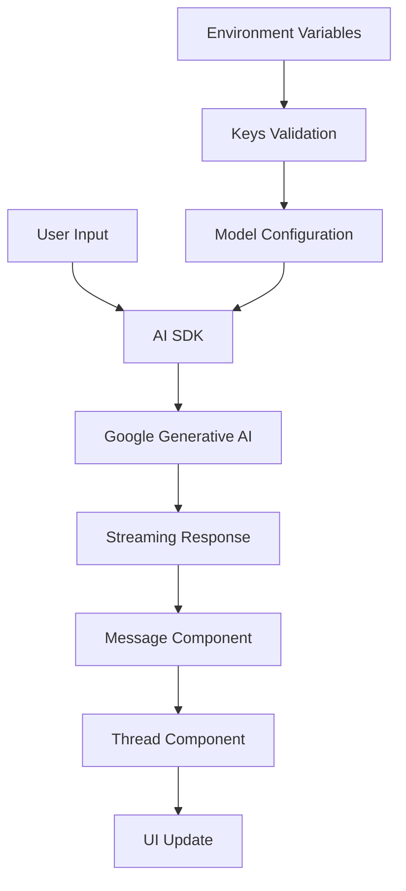

# @gabfon/ai Architecture

## Overview

The `@gabfon/ai` package is a lightweight wrapper around the Vercel AI SDK, specifically configured for Google Generative AI integration. It provides React components and utilities for building AI-powered chat interfaces with streaming capabilities.

## Architectural Decisions

### 1. Minimal Wrapper Pattern
- **Decision**: Export all AI SDK functionality directly rather than re-wrapping
- **Rationale**: Provides full access to AI SDK features while maintaining a clean upgrade path
- **Implementation**: Simple re-export in main index.ts

### 2. Component-Based UI
- **Decision**: Provide pre-built React components for common chat patterns
- **Rationale**: Reduces boilerplate for chat interface development
- **Components**: `Message` and `Thread` components with Tailwind styling

### 3. Environment-Driven Configuration
- **Decision**: Use `@t3-oss/env-nextjs` for type-safe environment variable handling
- **Rationale**: Ensures required API keys are present and validated at runtime
- **Implementation**: Centralized key management with Zod validation

## Module Organization

```
src/
├── components/          # React UI components
│   ├── message.tsx    # Individual chat message component
│   └── thread.tsx     # Chat thread container
├── lib/               # Core utilities
│   ├── models.ts      # AI model configurations
│   └── react.ts       # React hooks and utilities
├── keys.ts            # Environment variable validation
└── index.ts           # Main exports (AI SDK re-exports)
```

## Data Flow



## Key Dependencies

### Core Dependencies
- **`ai`**: Vercel AI SDK for streaming chat interfaces
- **`@ai-sdk/google`**: Google Generative AI provider
- **`react`**: React integration for components

### UI Dependencies
- **`streamdown`**: Markdown streaming renderer
- **`tailwind-merge`**: Utility for merging Tailwind classes

### Configuration Dependencies
- **`@t3-oss/env-nextjs`**: Environment variable validation
- **`zod`**: Runtime type validation

## Component Architecture

### Message Component
- **Purpose**: Renders individual chat messages with appropriate styling
- **Features**: 
  - Automatic role-based styling (user/assistant)
  - Markdown rendering with streaming support
  - Responsive design with max-width constraints

### Thread Component
- **Purpose**: Container for message threads
- **Features**: 
  - Message list management
  - Scroll handling
  - Accessibility support

## Model Configuration

The package provides pre-configured Google AI models:
- **Chat Model**: `gemini-1.5-flash` for conversational AI
- **Embeddings Model**: `text-embedding-004` for text embeddings

## Integration Patterns

### 1. Provider Setup
```typescript
// Environment configuration
const keys = await validateKeys();
```

### 2. Model Usage
```typescript
import { models } from '@gabfon/ai/lib/models';
const chatModel = models.chat;
```

### 3. Component Integration
```typescript
import { Message, Thread } from '@gabfon/ai/components';
```

## Security Considerations

1. **API Key Management**: Keys are validated at runtime and never exposed to client-side code
2. **Content Filtering**: Relies on Google AI's built-in safety filters
3. **Input Validation**: Uses Zod schemas for type safety

## Performance Optimizations

1. **Streaming**: Uses AI SDK's streaming capabilities for real-time responses
2. **Component Memoization**: React components optimized for re-rendering
3. **Lazy Loading**: Models are initialized on first use

## Future Extensibility

The architecture supports:
- Additional AI providers (OpenAI, Anthropic, etc.)
- Custom model configurations
- Additional UI components
- Advanced chat features (tool calling, function execution)

## Testing Strategy

- Unit tests for component rendering
- Integration tests for AI model interactions
- Environment validation tests
- Accessibility testing for UI components
