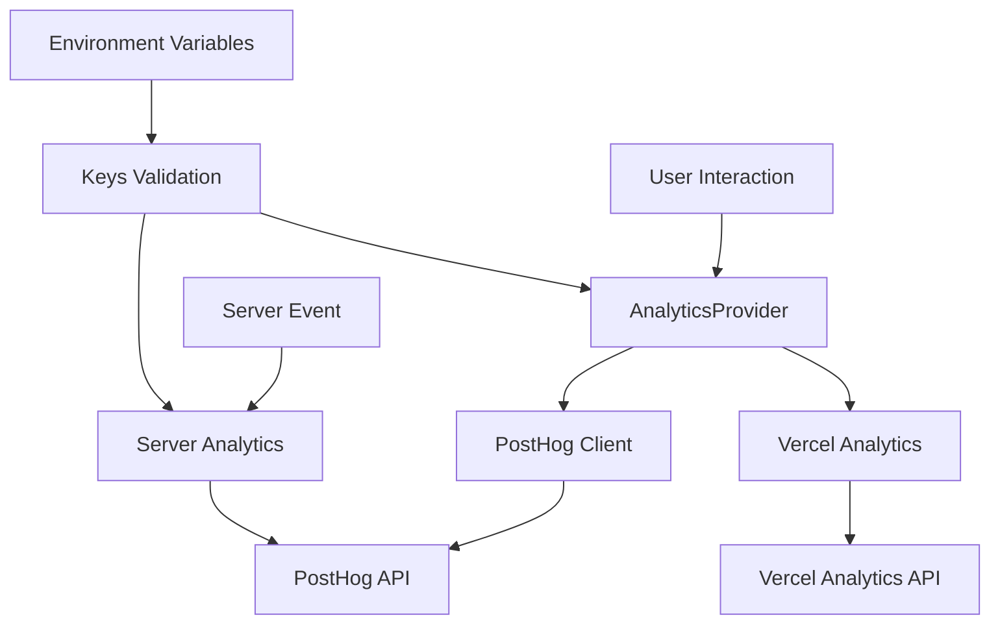

# @gabfon/analytics Architecture

## Overview

The `@gabfon/analytics` package provides a comprehensive analytics solution that combines PostHog and Vercel Analytics into a unified React provider. It supports both client-side and server-side tracking with type-safe environment configuration.

## Architectural Decisions

### 1. Dual Analytics Provider Pattern
- **Decision**: Integrate both PostHog and Vercel Analytics in a single provider
- **Rationale**: Leverages PostHog's powerful product analytics with Vercel's performance metrics
- **Implementation**: Combined `AnalyticsProvider` that wraps both services

### 2. Environment-Driven Configuration
- **Decision**: Use `@t3-oss/env-nextjs` for type-safe environment variable handling
- **Rationale**: Ensures analytics keys are validated and available at runtime
- **Implementation**: Centralized key management with conditional initialization

### 3. Client/Server Separation
- **Decision**: Separate client and server analytics implementations
- **Rationale**: Optimizes for different execution environments and prevents bundling issues
- **Implementation**: `client.tsx` for browser, `server.ts` for Node.js

### 4. Conditional Initialization
- **Decision**: Only initialize analytics when keys are available
- **Rationale**: Prevents errors in development/staging environments
- **Implementation**: Guard clauses in provider initialization

## Module Organization

```
src/
├── lib/
│   ├── client.tsx      # Client-side PostHog integration
│   └── server.ts       # Server-side PostHog integration
├── vercel.ts           # Vercel Analytics export
├── keys.ts             # Environment variable validation
└── index.tsx           # Main AnalyticsProvider
```

## Data Flow



## Key Dependencies

### Core Analytics
- **`posthog-js`**: Client-side PostHog integration
- **`posthog-node`**: Server-side PostHog integration
- **`@vercel/analytics`**: Vercel Analytics React component

### Configuration Dependencies
- **`@t3-oss/env-nextjs`**: Environment variable validation
- **`zod`**: Runtime type validation

### React Dependencies
- **`react`**: Provider component and hooks
- **`server-only`**: Server-side code isolation

## Provider Architecture

### AnalyticsProvider

The main provider component that:
- Wraps both PostHog and Vercel Analytics
- Handles conditional initialization
- Provides React context for analytics hooks
- Manages environment-specific configuration

### PostHog Configuration

```typescript
// Client-side configuration
posthog.init(NEXT_PUBLIC_POSTHOG_KEY, {
  api_host: '/ingest',
  ui_host: NEXT_PUBLIC_POSTHOG_HOST,
  person_profiles: 'identified_only',
  capture_pageview: false,
  capture_pageleave: true,
});

// Server-side configuration
new PostHog(NEXT_PUBLIC_POSTHOG_KEY, {
  host: NEXT_PUBLIC_POSTHOG_HOST,
  flushAt: 1,
  flushInterval: 0,
});
```

## Integration Patterns

### 1. Provider Setup
```typescript
// App root
<AnalyticsProvider>
  <App />
</AnalyticsProvider>
```

### 2. Client-Side Tracking
```typescript
import { useAnalytics } from '@gabfon/analytics/lib/client';

function Component() {
  const analytics = useAnalytics();
  analytics.track('button_clicked', { button: 'submit' });
}
```

### 3. Server-Side Tracking
```typescript
import { analytics } from '@gabfon/analytics/lib/server';

export async function POST() {
  analytics.capture('api_call', { endpoint: '/api/data' });
}
```

## Security Considerations

1. **Environment Variables**: Analytics keys are validated and never exposed to unauthorized contexts
2. **Data Privacy**: PostHog configured with `person_profiles: 'identified_only'`
3. **Server-Side Safety**: Server analytics isolated with `server-only` import

## Performance Optimizations

1. **Lazy Loading**: Analytics only initialized when keys are present
2. **Immediate Flushing**: Server-side events flushed immediately for serverless environments
3. **Selective Tracking**: Automatic pageview capture disabled for manual control

## Environment Configuration

### Required Variables

| Variable | Description | Environment | Required |
|----------|-------------|-------------|----------|
| `NEXT_PUBLIC_POSTHOG_KEY` | PostHog project API key | Client/Server | Yes |
| `NEXT_PUBLIC_POSTHOG_HOST` | PostHog instance host | Client/Server | Yes |

### Validation Strategy

Environment variables are validated using Zod schemas with runtime checking to ensure analytics services are properly configured before initialization.

## Error Handling

### Initialization Errors
- Graceful fallback when analytics keys are missing
- Silent failures in development environments
- Console warnings for configuration issues

### Runtime Errors
- Try-catch blocks around analytics calls
- Fallback to no-op functions when unavailable
- Error logging for debugging

## Testing Strategy

### Provider Testing
- Test provider renders without errors
- Verify conditional initialization behavior
- Test environment validation

### Hook Testing
- Test analytics hook functionality
- Verify event tracking calls
- Test error handling scenarios

### Server Testing
- Test server-side analytics initialization
- Verify event capture and flushing
- Test environment isolation

## Future Extensibility

The architecture supports:
- Additional analytics providers (Google Analytics, Mixpanel, etc.)
- Custom event tracking middleware
- Advanced privacy controls
- Real-time analytics dashboards
- A/B testing integration

## Migration Path

The package is designed to support:
- Easy provider swapping
- Gradual migration from single to multi-provider setup
- Backward compatibility with existing analytics implementations
- Configuration-driven provider selection
