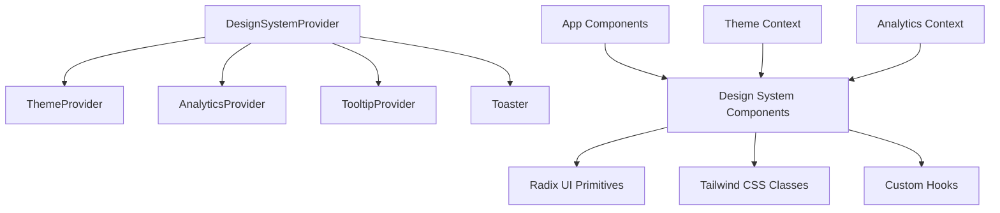

# @gabfon/design-system Architecture

## Overview

The `@gabfon/design-system` package is a comprehensive React component library built on Radix UI primitives, providing a cohesive design system with 30+ components, theming support, and utility hooks. It serves as the UI foundation for the entire application ecosystem.

## Architectural Decisions

### 1. Radix UI Foundation
- **Decision**: Build on Radix UI primitives for accessibility and behavior
- **Rationale**: Leverages battle-tested, accessible component foundations
- **Implementation**: All components extend Radix UI with custom styling and functionality

### 2. Tailwind CSS Integration
- **Decision**: Use Tailwind CSS for styling with custom design tokens
- **Rationale**: Provides consistent theming and responsive design capabilities
- **Implementation**: Utility-first approach with component-specific class merging

### 3. Provider-Based Architecture
- **Decision**: Centralized providers for theme, analytics, and UI utilities
- **Rationale**: Ensures consistent configuration across the application
- **Implementation**: `DesignSystemProvider` wraps all necessary providers

### 4. Component-First Export Strategy
- **Decision**: Export individual components and utilities for tree-shaking
- **Rationale**: Optimizes bundle size by allowing selective imports
- **Implementation**: Granular exports with barrel exports for convenience

## Module Organization

```
src/
├── components/          # React UI components (30+)
│   ├── button.tsx      # Button component
│   ├── dialog.tsx      # Dialog/Modal component
│   ├── dropdown-menu.tsx # Dropdown menu
│   └── ...             # Additional components
├── hooks/              # Custom React hooks
│   ├── use-debounce.tsx # Debounce utility
│   └── use-mobile.tsx  # Mobile detection
├── lib/                # Utility libraries
├── providers/          # React providers
│   └── theme.tsx       # Theme provider
├── globals.css         # Global CSS styles
├── index.tsx           # Main exports and provider
└── components.json     # shadcn/ui configuration
```

## Component Architecture

### Design Patterns

#### 1. Compound Component Pattern
```typescript
// Example: Dropdown Menu
<DropdownMenu>
  <DropdownMenuTrigger>Open</DropdownMenuTrigger>
  <DropdownMenuContent>
    <DropdownMenuItem>Item 1</DropdownMenuItem>
    <DropdownMenuItem>Item 2</DropdownMenuItem>
  </DropdownMenuContent>
</DropdownMenu>
```

#### 2. Forward Ref Pattern
```typescript
// All components forward refs for DOM access
const Button = React.forwardRef<
  HTMLButtonElement,
  ButtonProps
>(({ className, variant, size, ...props }, ref) => {
  return (
    <button
      className={cn(buttonVariants({ variant, size }), className)}
      ref={ref}
      {...props}
    />
  );
});
```

#### 3. Variant-Based Styling
```typescript
// Using class-variance-authority for variants
const buttonVariants = cva(
  "inline-flex items-center justify-center",
  {
    variants: {
      variant: {
        default: "bg-primary text-primary-foreground",
        destructive: "bg-destructive text-destructive-foreground",
      },
      size: {
        default: "h-10 px-4 py-2",
        sm: "h-9 rounded-md px-3",
      },
    },
  }
);
```

## Data Flow



## Key Dependencies

### UI Foundation
- **`@radix-ui/*`**: 20+ Radix UI packages for accessible primitives
- **`react`**: Core React functionality
- **`react-hook-form`**: Form integration and validation
- **`@hookform/resolvers`**: Form validation resolvers

### Styling & Theming
- **`tailwindcss`**: Utility-first CSS framework
- **`tailwind-merge`**: Utility for merging Tailwind classes
- **`class-variance-authority`**: Component variant management
- **`clsx`**: Conditional class utility
- **`next-themes`**: Theme switching functionality

### Icons & Graphics
- **`lucide-react`**: Icon library
- **`recharts`**: Chart components
- **`react-day-picker`**: Date picker component

### Advanced Components
- **`cmdk`**: Command palette functionality
- **`embla-carousel-react`**: Carousel component
- **`input-otp`**: One-time password input
- **`react-resizable-panels`**: Resizable panels
- **`vaul`**: Drawer/sheet component

## Provider Architecture

### DesignSystemProvider

The main provider that combines:
- **ThemeProvider**: Dark/light mode switching
- **AnalyticsProvider**: Event tracking integration
- **TooltipProvider**: Global tooltip configuration
- **Toaster**: Global toast notifications

### ThemeProvider

Built on `next-themes`:
- Supports system, light, and dark themes
- Persists theme preference
- Provides theme context to components

## Component Categories

### 1. Form Components
- Button, Input, Textarea, Label
- Checkbox, Radio Group, Switch
- Select, Dropdown Menu
- Form integration with react-hook-form

### 2. Navigation Components
- Navigation Menu, Menubar
- Tabs, Breadcrumb
- Command palette (cmdk)

### 3. Layout Components
- Sheet, Drawer, Dialog
- Scroll Area, Separator
- Aspect Ratio, Resizable Panels

### 4. Feedback Components
- Toast, Alert, Badge
- Progress, Skeleton, Spinner
- Tooltip, Hover Card

### 5. Data Display Components
- Table, Avatar
- Carousel, Chart (recharts)
- Calendar (react-day-picker)

### 6. Input Components
- Slider, Input OTP
- Date Picker
- Custom form inputs

## Styling Architecture

### 1. Design Tokens
```css
/* CSS Custom Properties for theming */
:root {
  --background: 0 0% 100%;
  --foreground: 222.2 84% 4.9%;
  --primary: 222.2 47.4% 11.2%;
  --destructive: 0 84.2% 60.2%;
}
```

### 2. Component Variants
```typescript
// Using class-variance-authority
const componentVariants = cva(baseClasses, {
  variants: {
    variant: { /* variant definitions */ },
    size: { /* size definitions */ },
  },
  defaultVariants: { /* defaults */ },
});
```

### 3. Responsive Design
```typescript
// Mobile-first responsive utilities
const responsiveClasses = {
  sm: "sm:text-sm",
  md: "md:text-base",
  lg: "lg:text-lg",
};
```

## Accessibility Features

### 1. Radix UI Accessibility
- All components inherit accessibility from Radix UI
- Proper ARIA attributes and keyboard navigation
- Screen reader compatibility

### 2. Focus Management
- Proper focus trapping in modals
- Focus restoration after closing
- Skip links and navigation

### 3. Semantic HTML
- Correct HTML element usage
- Proper heading hierarchy
- Landmark regions

## Performance Optimizations

### 1. Tree Shaking
- Individual component exports
- Minimal bundle impact
- Lazy loading support

### 2. Render Optimization
- React.memo for expensive components
- Proper key usage in lists
- Debounced inputs and events

### 3. CSS Optimization
- Purge-ready Tailwind classes
- Minimal CSS footprint
- Critical CSS inlining

## Integration Patterns

### 1. Form Integration
```typescript
import { useForm } from 'react-hook-form';
import { Button, Input, Form } from '@gabfon/design-system';

function MyForm() {
  const form = useForm();
  
  return (
    <Form {...form}>
      <Input {...form.register('name')} />
      <Button type="submit">Submit</Button>
    </Form>
  );
}
```

### 2. Theme Integration
```typescript
import { useTheme } from 'next-themes';

function ThemedComponent() {
  const { theme, setTheme } = useTheme();
  return <Button onClick={() => setTheme('dark')}>Toggle Theme</Button>;
}
```

### 3. Analytics Integration
```typescript
import { useAnalytics } from '@gabfon/analytics';

function TrackedButton() {
  const analytics = useAnalytics();
  return (
    <Button onClick={() => analytics.track('button_click')}>
      Click me
    </Button>
  );
}
```

## Testing Strategy

### 1. Component Testing
- Unit tests for component rendering
- Accessibility testing with jest-axe
- Visual regression testing

### 2. Integration Testing
- Form submission workflows
- Theme switching behavior
- Provider integration

### 3. E2E Testing
- User interaction flows
- Cross-browser compatibility
- Mobile responsiveness

## Future Extensibility

The architecture supports:
- Additional component variants
- Custom theme extensions
- Plugin system for components
- Design token management
- Component documentation generation
- Storybook integration

## Migration Path

The design system is designed to support:
- Gradual adoption of components
- Backward compatibility maintenance
- Breaking change management
- Versioned component releases
- Design system versioning
