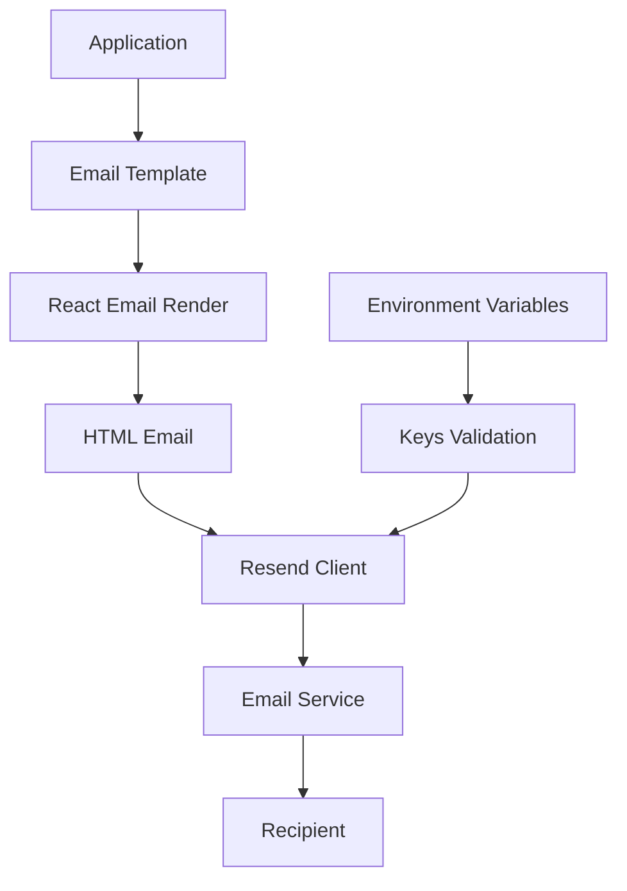

# @gabfon/email Architecture

## Overview

The `@gabfon/email` package provides a comprehensive email solution built on React Email and Resend. It offers a template-based approach for creating and sending emails with type-safe environment configuration and reusable React components.

## Architectural Decisions

### 1. React Email Integration
- **Decision**: Use React Email for template creation with JSX
- **Rationale**: Leverages React component patterns for email templates
- **Implementation**: Email templates as React components with HTML rendering

### 2. Resend as Email Provider
- **Decision**: Use Resend as the email sending service
- **Rationale**: Modern API-first email service with developer-friendly features
- **Implementation**: Pre-configured Resend client with environment validation

### 3. Template-Based Architecture
- **Decision**: Organize email templates as reusable components
- **Rationale**: Promotes consistency and reusability across email types
- **Implementation**: Templates directory with component-based templates

### 4. Environment-Driven Configuration
- **Decision**: Use `@t3-oss/env-nextjs` for type-safe environment variables
- **Rationale**: Ensures email configuration is validated at runtime
- **Implementation**: Centralized key management with Zod validation

## Module Organization

```
src/
├── templates/          # Email template components
│   └── contact.tsx   # Contact form email template
├── keys.ts            # Environment variable validation
└── index.ts           # Resend client export
```

## Data Flow



## Key Dependencies

### Core Email
- **`resend`**: Email sending service client
- **`@react-email/components`**: React Email component library
- **`@react-email/render`**: React Email HTML rendering

### React Dependencies
- **`react`**: Email template components
- **`react-dom`**: Server-side rendering for email templates

### Configuration Dependencies
- **`@t3-oss/env-nextjs`**: Environment variable validation
- **`zod`**: Runtime type validation

## Template Architecture

### Email Template Structure

```typescript
// Template component interface
interface EmailTemplateProps {
  // Template-specific props
  recipient: string;
  subject?: string;
  data: Record<string, any>;
}

// Template component
export function EmailTemplate({ recipient, data }: EmailTemplateProps) {
  return (
    <Html>
      <Head />
      <Preview>Email preview text</Preview>
      <Body style={main}>
        <Container>
          <Section>
            {/* Email content */}
          </Section>
        </Container>
      </Body>
    </Html>
  );
}
```

### Template Patterns

#### 1. Base Template Pattern
```typescript
// Base template with common layout
export function BaseTemplate({ children, ...props }) {
  return (
    <Html>
      <Head />
      <Body>
        <Container>
          <Header />
          {children}
          <Footer />
        </Container>
      </Body>
    </Html>
  );
}
```

#### 2. Specific Template Pattern
```typescript
// Specific template extending base
export function ContactTemplate({ data }) {
  return (
    <BaseTemplate>
      <Section>
        <Text>Name: {data.name}</Text>
        <Text>Email: {data.email}</Text>
        <Text>Message: {data.message}</Text>
      </Section>
    </BaseTemplate>
  );
}
```

## Client Architecture

### Resend Client

Pre-configured Resend client with environment validation:

```typescript
import { Resend } from 'resend';
import { keys } from './keys';

export const resend = new Resend(keys().RESEND_TOKEN);
```

### Environment Configuration

```typescript
export const keys = () =>
  createEnv({
    server: {
      RESEND_FROM: z.email(),
      RESEND_TOKEN: z.string().startsWith('re_'),
    },
    runtimeEnv: {
      RESEND_FROM: process.env.RESEND_FROM,
      RESEND_TOKEN: process.env.RESEND_TOKEN,
    },
    emptyStringAsUndefined: true,
    skipValidation: !process.env.SKIP_ENV_VALIDATION,
  });
```

## Integration Patterns

### 1. Template Usage
```typescript
import { ContactTemplate } from '@gabfon/email/templates';
import { render } from '@react-email/render';

async function sendContactEmail(data: ContactData) {
  const html = render(<ContactTemplate data={data} />);
  
  await resend.emails.send({
    from: keys().RESEND_FROM,
    to: data.recipient,
    subject: 'New Contact Form Submission',
    html,
  });
}
```

### 2. API Route Integration
```typescript
// app/api/contact/route.ts
import { resend } from '@gabfon/email';
import { ContactTemplate } from '@gabfon/email/templates';
import { render } from '@react-email/render';

export async function POST(request: Request) {
  const data = await request.json();
  
  const html = render(<ContactTemplate data={data} />);
  
  await resend.emails.send({
    from: process.env.RESEND_FROM,
    to: 'admin@example.com',
    subject: 'New Contact Form Submission',
    html,
  });

  return Response.json({ success: true });
}
```

### 3. Server Action Integration
```typescript
// actions/contact.ts
'use server';

import { resend } from '@gabfon/email';
import { ContactTemplate } from '@gabfon/email/templates';
import { render } from '@react-email/render';

export async function sendContactEmail(data: ContactData) {
  try {
    const html = render(<ContactTemplate data={data} />);
    
    await resend.emails.send({
      from: process.env.RESEND_FROM,
      to: 'admin@example.com',
      subject: 'New Contact Form Submission',
      html,
    });

    return { success: true };
  } catch (error) {
    return { success: false, error: error.message };
  }
}
```

## Security Considerations

### 1. Environment Variable Security
- Email tokens validated at runtime
- Tokens never exposed to client-side code
- Proper error handling for missing configuration

### 2. Content Security
- HTML sanitization for user input
- XSS prevention in email content
- Proper email header configuration

### 3. Rate Limiting
- Integration with rate limiting package
- API endpoint protection
- Email sending limits

## Performance Optimizations

### 1. Template Rendering
- Server-side rendering for email templates
- Template caching for repeated sends
- Optimized HTML generation

### 2. Email Delivery
- Batch sending capabilities
- Queue management for high volume
- Retry logic for failed sends

### 3. Bundle Optimization
- Tree-shaking for unused templates
- Minimal client-side footprint
- Server-side only dependencies

## Testing Strategy

### 1. Template Testing
- Visual testing of email rendering
- Cross-client compatibility testing
- Responsive design verification

### 2. Integration Testing
- End-to-end email sending
- API route testing
- Error handling verification

### 3. Unit Testing
- Template component testing
- Environment validation testing
- Client configuration testing

## Environment Configuration

### Required Variables

| Variable | Description | Type | Required |
|----------|-------------|------|----------|
| `RESEND_FROM` | Default from email address | email | Yes |
| `RESEND_TOKEN` | Resend API token | string | Yes |

### Validation Rules

- `RESEND_FROM`: Must be valid email format
- `RESEND_TOKEN`: Must start with 're_' prefix
- All variables are server-side only

## Error Handling

### Environment Validation Errors
```typescript
try {
  const env = keys();
  // Use environment variables
} catch (error) {
  console.error('Email configuration error:', error);
  // Handle missing or invalid environment variables
}
```

### Email Sending Errors
```typescript
try {
  await resend.emails.send(emailData);
} catch (error) {
  console.error('Email sending error:', error);
  // Handle API errors, rate limits, etc.
}
```

## Future Extensibility

The architecture supports:
- Additional email providers (SendGrid, Mailgun, etc.)
- Template inheritance and composition
- Email analytics and tracking
- Automated email campaigns
- Email template management system
- Multi-language email support

## Migration Path

The package is designed to support:
- Easy provider switching
- Gradual template migration
- Backward compatibility maintenance
- Versioned template releases
- Email service provider abstraction
