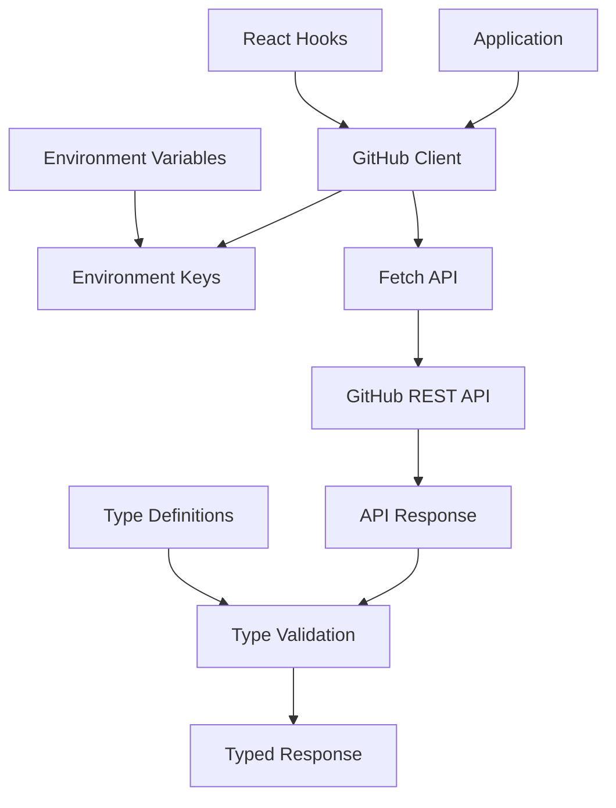

# @gabfon/github Architecture

## Overview

The `@gabfon/github` package provides a comprehensive GitHub API client built on modern web standards. It offers type-safe access to GitHub's REST API with support for users, repositories, events, contributions, and more, with built-in error handling and environment configuration.

## Architectural Decisions

### 1. REST API Client Pattern
- **Decision**: Implement a REST API client using native fetch
- **Rationale**: Leverages modern browser APIs with no external dependencies
- **Implementation**: Type-safe client with comprehensive error handling

### 2. Type-First Development
- **Decision**: Use TypeScript interfaces for all API responses
- **Rationale**: Ensures type safety and better developer experience
- **Implementation**: Comprehensive type definitions for GitHub API objects

### 3. Environment-Driven Configuration
- **Decision**: Use `@t3-oss/env-nextjs` for environment variable management
- **Rationale**: Ensures secure and validated configuration
- **Implementation**: Centralized key management with Zod validation

### 4. Modular Client Architecture
- **Decision**: Organize client methods by GitHub API categories
- **Rationale**: Provides clear separation of concerns and maintainability
- **Implementation**: Grouped methods for users, repos, events, etc.

## Module Organization

```
src/
├── index.ts           # Main client exports
├── client.ts          # GitHub API client implementation
├── types/             # TypeScript type definitions
│   ├── index.ts       # Type exports
│   ├── api.ts         # API response types
│   ├── users.ts       # User-related types
│   ├── repos.ts       # Repository types
│   ├── events.ts      # Event types
│   └── contributions.ts # Contribution types
├── hooks/             # React hooks
│   └── index.ts       # Hook exports
└── keys.ts            # Environment variable validation
```

## Data Flow



## Key Dependencies

### Core Dependencies
- **`react`**: React hooks support
- **`zod`**: Runtime type validation

### Configuration Dependencies
- **`@t3-oss/env-nextjs`**: Environment variable validation
- **`@gabfon/analytics`**: Optional analytics integration
- **`@gabfon/testing`**: Testing utilities

## Client Architecture

### GitHub Client

The main client class provides methods for interacting with GitHub's API:

```typescript
class GitHubClient {
  private baseUrl: string;
  private token?: string;

  constructor(options?: GitHubClientOptions);

  // User methods
  async getUser(username: string): Promise<GitHubUser>;
  async getUserRepos(username: string): Promise<GitHubRepo[]>;
  
  // Repository methods
  async getRepo(owner: string, repo: string): Promise<GitHubRepo>;
  async getRepoEvents(owner: string, repo: string): Promise<GitHubEvent[]>;
  
  // Event methods
  async getUserEvents(username: string): Promise<GitHubEvent[]>;
  
  // Contribution methods
  async getUserContributions(username: string): Promise<GitHubContribution[]>;
}
```

### Environment Configuration

```typescript
export const keys = () =>
  createEnv({
    server: {
      GITHUB_TOKEN: z.string().optional(),
    },
    client: {
      NEXT_PUBLIC_GITHUB_TOKEN: z.string().optional(),
    },
    runtimeEnv: {
      GITHUB_TOKEN: process.env.GITHUB_TOKEN,
      NEXT_PUBLIC_GITHUB_TOKEN: process.env.NEXT_PUBLIC_GITHUB_TOKEN,
    },
    emptyStringAsUndefined: true,
    skipValidation: !process.env.SKIP_ENV_VALIDATION,
  });
```

## Type System

### API Response Types

Comprehensive TypeScript interfaces for GitHub API responses:

```typescript
interface GitHubUser {
  id: number;
  login: string;
  name: string | null;
  email: string | null;
  bio: string | null;
  public_repos: number;
  followers: number;
  following: number;
  created_at: string;
  updated_at: string;
}

interface GitHubRepo {
  id: number;
  name: string;
  full_name: string;
  description: string | null;
  private: boolean;
  owner: GitHubUser;
  stargazers_count: number;
  language: string | null;
  created_at: string;
  updated_at: string;
}

interface GitHubEvent {
  id: string;
  type: string;
  actor: GitHubUser;
  repo: GitHubRepo;
  created_at: string;
  payload: Record<string, any>;
}
```

## Integration Patterns

### 1. Basic Client Usage

```typescript
import { GitHubClient } from '@gabfon/github';

const client = new GitHubClient({
  token: process.env.GITHUB_TOKEN,
});

const user = await client.getUser('gabfon');
const repos = await client.getUserRepos('gabfon');
```

### 2. React Hook Integration

```typescript
import { useGitHubUser, useGitHubRepos } from '@gabfon/github/hooks';

function UserProfile({ username }: { username: string }) {
  const { data: user, loading, error } = useGitHubUser(username);
  const { data: repos } = useGitHubRepos(username);

  if (loading) return <div>Loading...</div>;
  if (error) return <div>Error: {error.message}</div>;

  return (
    <div>
      <h1>{user?.name}</h1>
      <p>{user?.bio}</p>
      <h2>Repositories ({repos?.length})</h2>
    </div>
  );
}
```

### 3. Server-Side Usage

```typescript
// app/api/github/[username]/route.ts
import { githubClient } from '@gabfon/github';

export async function GET(
  request: Request,
  { params }: { params: { username: string } }
) {
  try {
    const user = await githubClient.getUser(params.username);
    return Response.json(user);
  } catch (error) {
    return Response.json(
      { error: 'User not found' },
      { status: 404 }
    );
  }
}
```

## Error Handling

### HTTP Error Handling

The client provides comprehensive error handling for various scenarios:

```typescript
class GitHubClient {
  private async handleResponse<T>(response: Response): Promise<T> {
    if (!response.ok) {
      if (response.status === 404) {
        throw new Error('Resource not found');
      }
      if (response.status === 403) {
        throw new Error('Access forbidden - check token permissions');
      }
      if (response.status === 429) {
        throw new Error('Rate limit exceeded');
      }
      throw new Error(`GitHub API error: ${response.status}`);
    }

    return response.json();
  }
}
```

### Network Error Handling

```typescript
async function fetchWithErrorHandling(url: string, options?: RequestInit) {
  try {
    const response = await fetch(url, options);
    return response;
  } catch (error) {
    if (error instanceof TypeError) {
      throw new Error('Network error - check connection');
    }
    throw error;
  }
}
```

## Performance Considerations

### 1. Request Optimization
- **Conditional Requests**: Use ETags for caching
- **Pagination**: Implement proper pagination for large datasets
- **Rate Limiting**: Respect GitHub's rate limits
- **Batching**: Combine multiple requests when possible

### 2. Memory Management
- **Stream Processing**: Use streaming for large responses
- **Response Caching**: Implement client-side caching
- **Lazy Loading**: Load data only when needed

### 3. React Integration
- **Memoization**: Cache API responses in hooks
- **Suspense**: Use React Suspense for data fetching
- **Error Boundaries**: Handle errors gracefully

## Security Considerations

### 1. Token Management
- **Server-Side Tokens**: Use server-side tokens for sensitive operations
- **Client-Side Tokens**: Use client-side tokens for public data only
- **Token Rotation**: Regularly rotate access tokens
- **Scope Limitation**: Use minimal required token scopes

### 2. Data Protection
- **Input Validation**: Validate all user inputs
- **Output Sanitization**: Sanitize API responses
- **Error Information**: Avoid exposing sensitive information in errors

### 3. Rate Limiting
- **Request Throttling**: Implement client-side throttling
- **Retry Logic**: Implement exponential backoff
- **Monitoring**: Track rate limit usage

## Testing Strategy

### 1. Unit Testing
- Test client methods with mocked responses
- Test error handling scenarios
- Test type validation

### 2. Integration Testing
- Test with actual GitHub API (using test tokens)
- Test React hooks with test components
- Test error flows end-to-end

### 3. Performance Testing
- Test response times
- Test memory usage
- Test rate limiting behavior

## Future Extensibility

The architecture supports:
- Additional GitHub API endpoints
- GraphQL API integration
- Webhook handling
- Real-time event streaming
- Advanced caching strategies
- Custom authentication methods

## Migration Path

The package is designed to support:
- Easy adoption in existing projects
- Gradual feature implementation
- Backward compatibility maintenance
- API version updates
- Breaking change management

## Best Practices

### 1. Client Usage
- Use appropriate error handling
- Implement proper caching
- Respect rate limits
- Use TypeScript for type safety

### 2. React Integration
- Use provided hooks for consistency
- Implement loading states
- Handle errors gracefully
- Use Suspense for better UX

### 3. Performance
- Cache responses when appropriate
- Use pagination for large datasets
- Implement lazy loading
- Monitor rate limit usage

### 4. Security
- Never expose tokens on client-side
- Use minimal required scopes
- Regularly rotate tokens
- Validate all inputs
