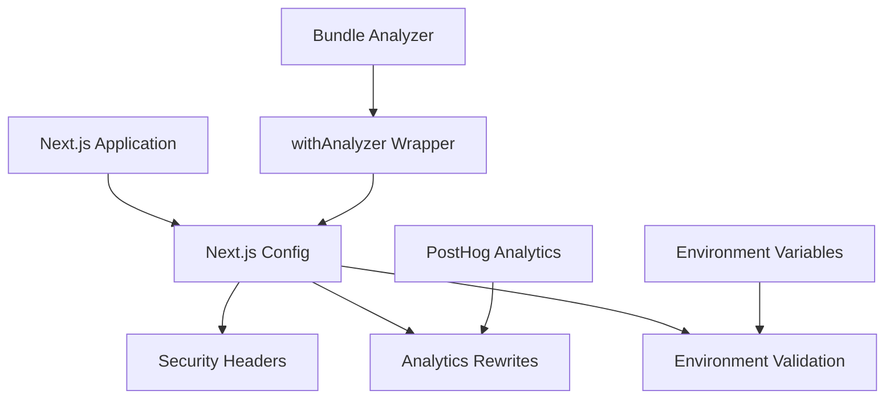

# @gabfon/next-config Architecture

## Overview

The `@gabfon/next-config` package provides a centralized Next.js configuration with security headers, analytics integration, and environment validation. It serves as the foundation for Next.js applications in the monorepo.

## Architectural Decisions

### 1. Security-First Configuration
- **Decision**: Implement comprehensive security headers by default
- **Rationale**: Ensures applications are secure by default without manual configuration
- **Implementation**: Content Security Policy, HSTS, X-Frame-Options, etc.

### 2. Analytics Integration
- **Decision**: Include PostHog analytics rewrites in base configuration
- **Rationale**: Provides seamless analytics integration across all applications
- **Implementation**: URL rewrites for PostHog API endpoints

### 3. Environment Validation
- **Decision**: Use `@t3-oss/env-nextjs` for type-safe environment variables
- **Rationale**: Ensures environment variables are validated and typed
- **Implementation**: Extends Vercel preset with custom variables

### 4. Bundle Analysis Support
- **Decision**: Include bundle analyzer as optional wrapper
- **Rationale**: Enables performance analysis when needed
- **Implementation**: Higher-order function for conditional bundle analysis

## Module Organization

```
src/
├── index.ts           # Main Next.js configuration
└── keys.ts            # Environment variable validation
```

## Configuration Architecture

### Security Headers

The configuration implements industry-standard security headers:

```typescript
headers: [
  {
    source: '/(.*)',
    headers: [
      {
        key: 'Content-Security-Policy',
        value: "default-src 'self'; script-src 'self' 'unsafe-inline'; style-src 'self' 'unsafe-inline'; img-src 'self' data:; connect-src 'self'; font-src 'self'; object-src 'none'; base-uri 'self';"
      },
      { key: 'X-Content-Type-Options', value: 'nosniff' },
      { key: 'X-Frame-Options', value: 'DENY' },
      { key: 'Referrer-Policy', value: 'strict-origin-when-cross-origin' },
      { key: 'Strict-Transport-Security', value: 'max-age=63072000; includeSubDomains; preload' }
    ]
  }
]
```

### Analytics Integration

PostHog analytics rewrites for seamless integration:

```typescript
rewrites: [
  {
    source: '/ingest/static/:path*',
    destination: 'https://us-assets.i.posthog.com/static/:path*'
  },
  {
    source: '/ingest/:path*',
    destination: 'https://us.i.posthog.com/:path*'
  },
  {
    source: '/ingest/decide',
    destination: 'https://us.i.posthog.com/decide'
  }
]
```

## Data Flow



## Key Dependencies

### Core Dependencies
- **`next`**: Next.js framework (peer dependency)
- **`@next/bundle-analyzer`**: Bundle analysis tool
- **`@prisma/nextjs-monorepo-workaround-plugin`**: Monorepo compatibility

### Configuration Dependencies
- **`@t3-oss/env-nextjs`**: Environment variable validation
- **`@t3-oss/env-core`**: Core environment utilities
- **`zod`**: Runtime type validation

## Security Architecture

### Content Security Policy (CSP)

The CSP is configured with a restrictive policy:

- **default-src**: 'self' - Only allow resources from same origin
- **script-src**: 'self' 'unsafe-inline' - Allow inline scripts for React
- **style-src**: 'self' 'unsafe-inline' - Allow inline styles for Tailwind
- **img-src**: 'self' data: - Allow images from same origin and data URLs
- **connect-src**: 'self' - Only allow API calls to same origin
- **font-src**: 'self' - Only allow fonts from same origin
- **object-src**: 'none' - Disallow plugins
- **base-uri**: 'self' - Restrict base tag to same origin

### Additional Security Headers

- **X-Content-Type-Options**: nosniff - Prevent MIME type sniffing
- **X-Frame-Options**: DENY - Prevent clickjacking
- **Referrer-Policy**: strict-origin-when-cross-origin - Control referrer information
- **Strict-Transport-Security**: HSTS with preload - Force HTTPS

## Environment Configuration

### Environment Variables

The configuration extends the Vercel preset with custom variables:

```typescript
export const keys = () =>
  createEnv({
    extends: [vercel()],
    server: {
      ANALYZE: z.string().optional(),
      NEXT_RUNTIME: z.enum(['nodejs', 'edge']).optional(),
    },
    client: {
      NEXT_PUBLIC_WEB_URL: z.url().min(1),
    },
    runtimeEnv: {
      ANALYZE: process.env.ANALYZE,
      NEXT_RUNTIME: process.env.NEXT_RUNTIME,
      NEXT_PUBLIC_WEB_URL: process.env.NEXT_PUBLIC_WEB_URL,
    },
    emptyStringAsUndefined: true,
    skipValidation: !process.env.SKIP_ENV_VALIDATION,
  });
```

### Variable Categories

#### Server-Side Variables
- **`ANALYZE`**: Optional flag for bundle analysis
- **`NEXT_RUNTIME`**: Runtime environment (nodejs/edge)

#### Client-Side Variables
- **`NEXT_PUBLIC_WEB_URL`**: Public web URL for the application

#### Vercel Preset Variables
- All standard Vercel environment variables are included

## Bundle Analysis

### withAnalyzer Wrapper

Conditional bundle analysis wrapper:

```typescript
export const withAnalyzer = (sourceConfig: NextConfig): NextConfig =>
  withBundleAnalyzer()(sourceConfig);
```

### Usage Pattern

```typescript
// next.config.js
import { config, withAnalyzer } from '@gabfon/next-config';

const finalConfig = process.env.ANALYZE 
  ? withAnalyzer(config)
  : config;

export default finalConfig;
```

## Integration Patterns

### 1. Basic Usage

```typescript
// next.config.js
import { config } from '@gabfon/next-config';

export default config;
```

### 2. With Custom Configuration

```typescript
// next.config.js
import { config } from '@gabfon/next-config';

const customConfig = {
  ...config,
  experimental: {
    appDir: true,
  },
  images: {
    domains: ['example.com'],
  },
};

export default customConfig;
```

### 3. With Bundle Analysis

```typescript
// next.config.js
import { config, withAnalyzer } from '@gabfon/next-config';

export default withAnalyzer(config);
```

### 4. Environment-Specific Configuration

```typescript
// next.config.js
import { config } from '@gabfon/next-config';

const isDevelopment = process.env.NODE_ENV === 'development';

const finalConfig = {
  ...config,
  ...(isDevelopment && {
    logging: {
      fetches: {
        fullUrl: true,
      },
    },
  }),
};

export default finalConfig;
```

## Performance Optimizations

### 1. Security Header Optimization
- Headers are applied globally to all routes
- Minimal overhead on request processing
- No additional runtime dependencies

### 2. Analytics Rewrite Optimization
- Rewrites are processed at the edge
- No additional client-side overhead
- Seamless integration with PostHog

### 3. Bundle Analysis Optimization
- Conditional analysis only when needed
- No impact on production builds
- Detailed bundle insights when enabled

## Testing Strategy

### 1. Configuration Validation
- Test security headers are properly applied
- Verify analytics rewrites work correctly
- Validate environment variable schema

### 2. Integration Testing
- Test configuration with Next.js applications
- Verify bundle analysis functionality
- Test environment-specific behavior

### 3. Security Testing
- Verify CSP headers prevent XSS
- Test HSTS implementation
- Validate other security headers

## Future Extensibility

The architecture supports:
- Additional security headers
- Custom rewrite rules
- Environment-specific configurations
- Performance optimizations
- Additional analytics providers
- Custom middleware integration

## Migration Path

The package is designed to support:
- Easy adoption in existing Next.js applications
- Gradual security header implementation
- Backward compatibility maintenance
- Configuration versioning
- Breaking change management

## Best Practices

### 1. Security
- Regularly review and update CSP policies
- Monitor security header effectiveness
- Keep dependencies updated
- Test security configurations

### 2. Performance
- Use bundle analysis for optimization
- Monitor rewrite performance
- Test configuration impact
- Optimize for production

### 3. Environment Management
- Use environment-specific configurations
- Validate environment variables
- Secure sensitive configuration
- Document environment requirements

### 4. Maintenance
- Keep Next.js version updated
- Review security headers regularly
- Test configuration changes
- Monitor performance impact
