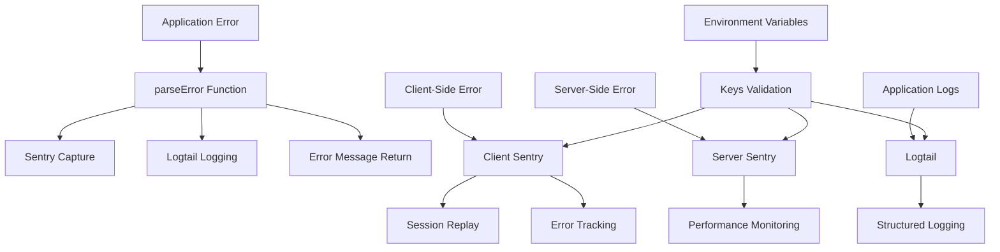

# @gabfon/observability Architecture

## Overview

The `@gabfon/observability` package provides comprehensive error tracking, logging, and performance monitoring capabilities by integrating Sentry and Logtail. It offers both client-side and server-side observability with automatic error capture and session replay functionality.

## Architectural Decisions

### 1. Dual Logging Strategy
- **Decision**: Combine Sentry for error tracking with Logtail for structured logging
- **Rationale**: Provides comprehensive observability with different strengths for each service
- **Implementation**: Sentry for exceptions, Logtail for application logs

### 2. Client/Server Separation
- **Decision**: Separate configurations for client and server environments
- **Rationale**: Optimizes for different execution contexts and privacy requirements
- **Implementation**: Client-side Sentry with session replay, server-side error capture

### 3. Automatic Error Handling
- **Decision**: Provide automatic error parsing and capture utilities
- **Rationale**: Reduces boilerplate and ensures consistent error handling
- **Implementation**: `parseError` function with automatic Sentry capture

### 4. Environment-Driven Configuration
- **Decision**: Use `@t3-oss/env-nextjs` for type-safe environment configuration
- **Rationale**: Ensures observability services are properly configured
- **Implementation**: Centralized key management with validation

## Module Organization

```
src/
├── client.ts           # Client-side Sentry configuration
├── index.ts            # Main error parsing utilities
├── instrumentation.ts  # Server-side instrumentation
├── keys.ts             # Environment variable validation
├── log.ts              # Logtail logging configuration
└── next-config.ts      # Next.js configuration for observability
```

## Data Flow



## Key Dependencies

### Error Tracking
- **`@sentry/nextjs`**: Sentry integration for Next.js applications
- **`@logtail/next`**: Logtail logging for Next.js

### Configuration Dependencies
- **`@t3-oss/env-nextjs`**: Environment variable validation
- **`zod`**: Runtime type validation
- **`server-only`**: Server-side code isolation

### React Dependencies
- **`react`**: React integration for client-side error handling

## Client-Side Architecture

### Sentry Client Configuration

```typescript
export const initializeSentry = (): ReturnType<typeof init> =>
  init({
    dsn: keys().NEXT_PUBLIC_SENTRY_DSN,
    tracesSampleRate: 1,
    debug: false,
    replaysOnErrorSampleRate: 1,
    replaysSessionSampleRate: 0.1,
    integrations: [
      replayIntegration({
        maskAllText: true,
        blockAllMedia: true,
      }),
    ],
  });
```

### Session Replay Features

- **Error Replay**: Automatic session recording on errors
- **Privacy Protection**: Text masking and media blocking
- **Performance Monitoring**: Trace sampling for performance insights
- **User Interaction Tracking**: Comprehensive user behavior analysis

## Server-Side Architecture

### Instrumentation Setup

```typescript
import * as Sentry from '@sentry/nextjs';
import { log } from './log';

export function register() {
  if (process.env.NEXT_RUNTIME === 'nodejs') {
    Sentry.init({
      dsn: keys().SENTRY_DSN,
      tracesSampleRate: 1,
    });
  }
}
```

### Server-Side Logging

```typescript
import { Logtail } from '@logtail/next';

export const log = new Logtail(keys().LOGTAIL_SOURCE_TOKEN);
```

## Error Handling Architecture

### parseError Function

Centralized error parsing with automatic capture:

```typescript
export const parseError = (error: unknown): string => {
  let message = 'An error occurred';

  if (error instanceof Error) {
    message = error.message;
  } else if (error && typeof error === 'object' && 'message' in error) {
    message = error.message as string;
  } else {
    message = String(error);
  }

  try {
    captureException(error);
    log.error(`Parsing error: ${message}`);
  } catch (newError) {
    console.error('Error parsing error:', newError);
  }

  return message;
};
```

### Error Types Handled

1. **Error Objects**: Standard JavaScript errors
2. **Object Errors**: Objects with message properties
3. **Primitive Errors**: String, number, boolean values
4. **Unknown Errors**: Fallback to string conversion

## Integration Patterns

### 1. Client-Side Integration

```typescript
// app/layout.tsx
import { initializeSentry } from '@gabfon/observability/client';

initializeSentry();

export default function RootLayout({ children }) {
  return <html>{children}</html>;
}
```

### 2. Server-Side Integration

```typescript
// instrumentation.ts
import { register } from '@gabfon/observability/instrumentation';

export function register() {
  // Register observability
}
```

### 3. Error Handling Integration

```typescript
// components/ErrorBoundary.tsx
import { parseError } from '@gabfon/observability';

class ErrorBoundary extends React.Component {
  componentDidCatch(error: Error, errorInfo: React.ErrorInfo) {
    const message = parseError(error);
    // Handle error display
  }
}
```

### 4. API Route Integration

```typescript
// app/api/example/route.ts
import { parseError } from '@gabfon/observability';

export async function POST(request: Request) {
  try {
    // API logic
  } catch (error) {
    const message = parseError(error);
    return Response.json({ error: message }, { status: 500 });
  }
}
```

## Environment Configuration

### Required Variables

| Variable | Description | Type | Environment | Required |
|----------|-------------|------|-------------|----------|
| `NEXT_PUBLIC_SENTRY_DSN` | Sentry DSN for client-side | string | Client | Yes |
| `SENTRY_DSN` | Sentry DSN for server-side | string | Server | Yes |
| `LOGTAIL_SOURCE_TOKEN` | Logtail source token | string | Server | Yes |

### Environment Validation

```typescript
export const keys = () =>
  createEnv({
    server: {
      SENTRY_DSN: z.string(),
      LOGTAIL_SOURCE_TOKEN: z.string(),
    },
    client: {
      NEXT_PUBLIC_SENTRY_DSN: z.string(),
    },
    runtimeEnv: {
      SENTRY_DSN: process.env.SENTRY_DSN,
      LOGTAIL_SOURCE_TOKEN: process.env.LOGTAIL_SOURCE_TOKEN,
      NEXT_PUBLIC_SENTRY_DSN: process.env.NEXT_PUBLIC_SENTRY_DSN,
    },
    emptyStringAsUndefined: true,
    skipValidation: !process.env.SKIP_ENV_VALIDATION,
  });
```

## Performance Monitoring

### Client-Side Performance

- **Trace Sampling**: 100% sampling for detailed performance data
- **Session Replay**: 10% session sampling for replay functionality
- **Error Replay**: 100% replay sampling on errors
- **User Interaction Tracking**: Automatic user behavior capture

### Server-Side Performance

- **Request Tracing**: Automatic request span creation
- **Database Query Tracking**: Database performance monitoring
- **API Performance**: Endpoint performance metrics
- **Error Rate Monitoring**: Error frequency and patterns

## Security Considerations

### Data Privacy

1. **PII Protection**: Automatic masking of sensitive information
2. **Session Privacy**: Text masking and media blocking in replays
3. **Data Minimization**: Only essential data sent to observability services
4. **Consent Management**: User consent for session recording

### Security Headers

- **CSP Compatibility**: Works with Content Security Policy
- **Secure Transmission**: All data sent over HTTPS
- **Access Control**: Proper authentication and authorization
- **Data Retention**: Configurable data retention policies

## Testing Strategy

### 1. Error Handling Testing
- Test error parsing with various error types
- Verify Sentry capture functionality
- Test Logtail logging integration
- Validate error message formatting

### 2. Performance Testing
- Test performance monitoring overhead
- Verify session replay functionality
- Test trace sampling accuracy
- Validate performance metrics

### 3. Integration Testing
- Test client-side initialization
- Test server-side instrumentation
- Verify environment variable validation
- Test error boundary integration

## Future Extensibility

The architecture supports:
- Additional observability providers (DataDog, New Relic, etc.)
- Custom error handling patterns
- Advanced performance monitoring
- Real-time alerting systems
- Custom metrics and dashboards
- A/B testing integration

## Migration Path

The package is designed to support:
- Easy provider switching
- Gradual adoption of features
- Backward compatibility maintenance
- Configuration versioning
- Breaking change management

## Best Practices

### 1. Error Handling
- Use `parseError` for consistent error handling
- Implement proper error boundaries
- Log errors with appropriate context
- Monitor error rates and patterns

### 2. Performance Monitoring
- Monitor application performance metrics
- Set up appropriate alerting thresholds
- Regular review of performance data
- Optimize based on insights

### 3. Privacy & Security
- Respect user privacy preferences
- Implement proper data retention
- Secure observability configuration
- Regular security audits

### 4. Configuration Management
- Use environment-specific configurations
- Validate environment variables
- Secure sensitive configuration
- Document configuration requirements
