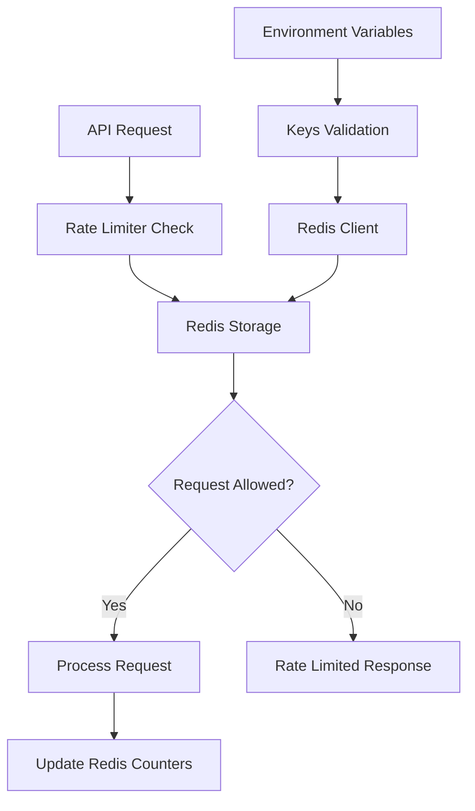

# @gabfon/rate-limit Architecture

## Overview

The `@gabfon/rate-limit` package provides a comprehensive rate limiting solution built on Upstash Redis. It offers flexible rate limiting algorithms with Redis-backed storage for distributed applications, ensuring consistent rate limiting across multiple server instances.

## Architectural Decisions

### 1. Upstash Redis Integration
- **Decision**: Use Upstash Redis for distributed rate limiting storage
- **Rationale**: Provides serverless Redis with automatic scaling and global distribution
- **Implementation**: Pre-configured Redis client with environment-based authentication

### 2. Flexible Rate Limiting Algorithms
- **Decision**: Support multiple rate limiting algorithms through Upstash Ratelimit
- **Rationale**: Different use cases require different rate limiting strategies
- **Implementation**: Sliding window, fixed window, and token bucket algorithms

### 3. Factory Pattern for Rate Limiters
- **Decision**: Use factory function for creating rate limiters
- **Rationale**: Provides consistent configuration and easy instantiation
- **Implementation**: `createRateLimiter` function with sensible defaults

### 4. Environment-Driven Configuration
- **Decision**: Use `@t3-oss/env-nextjs` for Redis configuration
- **Rationale**: Ensures Redis credentials are validated and typed
- **Implementation**: Centralized key management with Zod validation

## Module Organization

```
src/
├── index.ts           # Rate limiter factory and algorithms
├── keys.ts            # Environment variable validation
└── redis.ts           # Redis client configuration
```

## Data Flow



## Key Dependencies

### Core Rate Limiting
- **`@upstash/ratelimit`**: Rate limiting algorithms and utilities
- **`@upstash/redis`**: Serverless Redis client

### Configuration Dependencies
- **`@t3-oss/env-nextjs`**: Environment variable validation
- **`zod`**: Runtime type validation

## Rate Limiting Architecture

### Rate Limiter Factory

```typescript
export const createRateLimiter = (props: Omit<RatelimitConfig, 'redis'>) =>
  new Ratelimit({
    redis,
    limiter: props.limiter ?? Ratelimit.slidingWindow(10, '10 s'),
    prefix: props.prefix ?? 'gabfon',
  });
```

### Supported Algorithms

#### 1. Sliding Window
- **Use Case**: General purpose rate limiting with time-based windows
- **Behavior**: Counts requests within a sliding time window
- **Configuration**: `Ratelimit.slidingWindow(requests, window)`

#### 2. Fixed Window
- **Use Case**: Simple rate limiting with fixed time boundaries
- **Behavior**: Resets counter at fixed intervals
- **Configuration**: `Ratelimit.fixedWindow(requests, window)`

#### 3. Token Bucket
- **Use Case**: Burst traffic handling with sustained rate limits
- **Behavior**: Allows bursts up to bucket capacity
- **Configuration**: `Ratelimit.tokenBucket(refillRate, interval, bucketSize)`

## Redis Configuration

### Redis Client Setup

```typescript
export const redis = new Redis({
  url: keys().KV_REST_API_URL,
  token: keys().KV_REST_API_TOKEN,
});
```

### Environment Variables

| Variable | Description | Type | Required |
|----------|-------------|------|----------|
| `KV_REST_API_URL` | Upstash Redis REST API URL | string | Yes |
| `KV_REST_API_TOKEN` | Upstash Redis REST API token | string | Yes |

## Integration Patterns

### 1. API Route Rate Limiting

```typescript
// app/api/protected/route.ts
import { createRateLimiter } from '@gabfon/rate-limit';

const rateLimiter = createRateLimiter({
  limiter: Ratelimit.slidingWindow(10, '10 s'),
  prefix: 'api-protected',
});

export async function POST(request: Request) {
  const ip = request.ip || 'unknown';
  
  const { success, limit, remaining, reset } = await rateLimiter.limit(ip);
  
  if (!success) {
    return Response.json(
      { error: 'Rate limit exceeded' },
      { 
        status: 429,
        headers: {
          'X-RateLimit-Limit': limit.toString(),
          'X-RateLimit-Remaining': remaining.toString(),
          'X-RateLimit-Reset': reset.toString(),
        }
      }
    );
  }
  
  // Process request
  return Response.json({ success: true });
}
```

### 2. User-Specific Rate Limiting

```typescript
// app/api/user-action/route.ts
import { createRateLimiter } from '@gabfon/rate-limit';

const userRateLimiter = createRateLimiter({
  limiter: Ratelimit.slidingWindow(5, '1 m'),
  prefix: 'user-action',
});

export async function POST(request: Request) {
  const { userId } = await request.json();
  
  const { success } = await userRateLimiter.limit(userId);
  
  if (!success) {
    return Response.json(
      { error: 'User rate limit exceeded' },
      { status: 429 }
    );
  }
  
  // Process user action
  return Response.json({ success: true });
}
```

### 3. Global Rate Limiting

```typescript
// middleware.ts
import { createRateLimiter } from '@gabfon/rate-limit';

const globalRateLimiter = createRateLimiter({
  limiter: Ratelimit.slidingWindow(100, '1 m'),
  prefix: 'global',
});

export async function middleware(request: Request) {
  const ip = request.ip || 'unknown';
  
  const { success } = await globalRateLimiter.limit(ip);
  
  if (!success) {
    return new Response('Too Many Requests', { status: 429 });
  }
  
  return NextResponse.next();
}
```

## Performance Considerations

### 1. Redis Performance
- **Latency**: Upstash Redis provides low-latency access globally
- **Scalability**: Automatic scaling handles increased load
- **Reliability**: Built-in redundancy and failover

### 2. Rate Limiting Overhead
- **Minimal Impact**: Single Redis operation per request
- **Async Operations**: Non-blocking rate limit checks
- **Caching**: Redis provides efficient counter storage

### 3. Memory Usage
- **Efficient Storage**: Redis uses optimized data structures
- **TTL Management**: Automatic cleanup of expired entries
- **Prefix Isolation**: Separate namespaces for different limiters

## Security Considerations

### 1. Key Management
- **Environment Variables**: Redis credentials stored securely
- **Access Control**: Limited permissions for rate limiting operations
- **Token Rotation**: Regular token refresh for security

### 2. Rate Limit Bypass Prevention
- **IP-Based Limiting**: Uses client IP addresses
- **User-Based Limiting**: Uses authenticated user IDs
- **Request Identification**: Multiple identification strategies

### 3. DDoS Protection
- **Global Limits**: Application-wide rate limits
- **Endpoint Limits**: Specific endpoint rate limits
- **Cascading Limits**: Multiple layers of rate limiting

## Error Handling

### Redis Connection Errors

```typescript
import { createRateLimiter } from '@gabfon/rate-limit';

const rateLimiter = createRateLimiter({
  limiter: Ratelimit.slidingWindow(10, '10 s'),
});

export async function safeRateLimit(identifier: string) {
  try {
    const result = await rateLimiter.limit(identifier);
    return result;
  } catch (error) {
    // Fallback to allow request if Redis is unavailable
    console.error('Rate limiting error:', error);
    return { success: true, limit: 0, remaining: 0, reset: 0 };
  }
}
```

### Configuration Errors

```typescript
import { keys } from '@gabfon/rate-limit';

try {
  const env = keys();
  // Use environment variables
} catch (error) {
  console.error('Rate limiting configuration error:', error);
  // Handle missing or invalid environment variables
}
```

## Testing Strategy

### 1. Unit Testing
- Test rate limiter factory function
- Test different algorithm configurations
- Test Redis client initialization

### 2. Integration Testing
- Test rate limiting with actual Redis
- Test concurrent request handling
- Test rate limit reset behavior

### 3. Performance Testing
- Test rate limiting under high load
- Measure Redis operation latency
- Test memory usage patterns

## Monitoring and Analytics

### Rate Limit Metrics

```typescript
// Custom rate limiting with analytics
import { createRateLimiter } from '@gabfon/rate-limit';
import { analytics } from '@gabfon/analytics/lib/server';

const rateLimiter = createRateLimiter({
  limiter: Ratelimit.slidingWindow(10, '10 s'),
});

export async function rateLimitWithTracking(identifier: string) {
  const result = await rateLimiter.limit(identifier);
  
  // Track rate limit events
  if (!result.success) {
    analytics.capture('rate_limit_exceeded', {
      identifier,
      limit: result.limit,
      remaining: result.remaining,
    });
  }
  
  return result;
}
```

### Performance Monitoring

```typescript
// Rate limiting with performance tracking
export async function rateLimitWithMetrics(identifier: string) {
  const start = performance.now();
  
  const result = await rateLimiter.limit(identifier);
  
  const duration = performance.now() - start;
  
  // Log performance metrics
  console.log(`Rate limit check took ${duration}ms`);
  
  return result;
}
```

## Future Extensibility

The architecture supports:
- Additional rate limiting algorithms
- Custom storage backends
- Advanced rate limiting strategies
- Distributed rate limiting coordination
- Real-time rate limit monitoring
- Adaptive rate limiting based on traffic patterns

## Migration Path

The package is designed to support:
- Easy storage backend switching
- Gradual algorithm migration
- Backward compatibility maintenance
- Configuration versioning
- Breaking change management

## Best Practices

### 1. Rate Limiting Strategy
- Use appropriate algorithms for use cases
- Set reasonable limits based on user behavior
- Implement multiple layers of rate limiting
- Monitor rate limit effectiveness

### 2. Performance Optimization
- Use efficient Redis operations
- Implement proper error handling
- Monitor Redis performance metrics
- Optimize rate limit check frequency

### 3. Security
- Use secure Redis credentials
- Implement proper access controls
- Monitor for rate limit bypass attempts
- Regular security audits

### 4. Configuration Management
- Use environment-specific configurations
- Validate environment variables
- Secure sensitive configuration
- Document configuration requirements
