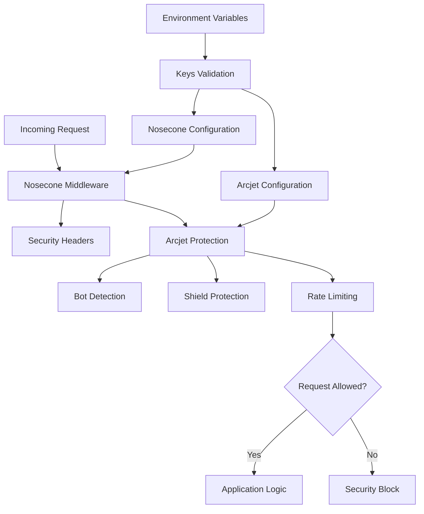

# @gabfon/security Architecture

## Overview

The `@gabfon/security` package provides comprehensive security protection through Arcjet and Nosecone integration. It offers bot detection, request shielding, rate limiting, and security headers to protect Next.js applications from common web vulnerabilities and attacks.

## Architectural Decisions

### 1. Dual Security Layer Approach
- **Decision**: Combine Arcjet for runtime protection with Nosecone for security headers
- **Rationale**: Provides comprehensive security at both application and infrastructure levels
- **Implementation**: Arcjet for request filtering, Nosecone for HTTP security headers

### 2. Bot Detection and Shielding
- **Decision**: Implement proactive bot detection and attack shielding
- **Rationale**: Prevents automated attacks and malicious traffic before they reach application logic
- **Implementation**: Arcjet Shield with configurable bot detection rules

### 3. Environment-Aware Configuration
- **Decision**: Use environment-specific security configurations
- **Rationale**: Balances security with development experience
- **Implementation**: Different CSP policies for development vs production

### 4. Middleware Integration Pattern
- **Decision**: Provide middleware-based security enforcement
- **Rationale**: Ensures security is applied consistently across all routes
- **Implementation**: Nosecone middleware with configurable options

## Module Organization

```
src/
├── index.ts           # Arcjet security functions
├── keys.ts            # Environment variable validation
└── proxy.ts           # Nosecone security headers configuration
```

## Data Flow



## Key Dependencies

### Security Services
- **`@arcjet/next`**: Arcjet security SDK for Next.js
- **`@nosecone/next`**: Nosecone security headers for Next.js

### Configuration Dependencies
- **`@t3-oss/env-nextjs`**: Environment variable validation
- **`zod`**: Runtime type validation

## Security Architecture

### Arcjet Integration

The package uses Arcjet for runtime security protection:

```typescript
const base = arcjet({
  key: arcjetKey,
  characteristics: ['ip.src'],
  rules: [
    shield({
      mode: 'LIVE',
    }),
    detectBot({
      mode: 'LIVE',
      allow: allowedBots,
    }),
  ],
});
```

### Security Layers

#### 1. Shield Protection
- **Purpose**: Protect against common attacks (SQL injection, XSS, CSRF)
- **Mode**: LIVE (blocks requests) or DRY_RUN (logs only)
- **Coverage**: Automatic protection for known attack patterns

#### 2. Bot Detection
- **Purpose**: Identify and block malicious bots
- **Categories**: Well-known bots, bot categories
- **Configuration**: Allowlist approach for permitted bots

#### 3. Rate Limiting
- **Purpose**: Prevent abuse and DoS attacks
- **Basis**: IP address identification
- **Integration**: Automatic with Arcjet Shield

### Nosecone Integration

Security headers configuration with environment awareness:

```typescript
export const noseconeOptions = {
  ...defaults,
  contentSecurityPolicy: isDevelopment ? {
    directives: {
      ...defaults.contentSecurityPolicy?.directives,
      scriptSrc: [
        ...(defaults.contentSecurityPolicy?.directives?.scriptSrc || ["'self'"]),
        "'unsafe-eval'", // Required for React development
      ],
    },
  } : false,
};
```

## Environment Configuration

### Required Variables

| Variable | Description | Type | Required |
|----------|-------------|------|----------|
| `ARCJET_KEY` | Arcjet API key for security protection | string | Yes |
| `NODE_ENV` | Environment identifier (development/production) | string | Yes |

### Environment Validation

```typescript
export const keys = () =>
  createEnv({
    server: {
      ARCJET_KEY: z.string(),
      NODE_ENV: z.enum(['development', 'production']),
    },
    runtimeEnv: {
      ARCJET_KEY: process.env.ARCJET_KEY,
      NODE_ENV: process.env.NODE_ENV,
    },
    emptyStringAsUndefined: true,
    skipValidation: !process.env.SKIP_ENV_VALIDATION,
  });
```

## Integration Patterns

### 1. API Route Protection

```typescript
// app/api/protected/route.ts
import { secure } from '@gabfon/security';

export async function POST(request: Request) {
  // Protect against bots and attacks
  await secure(['CATEGORY:SEARCH_ENGINE', 'CATEGORY:MONITOR'], request);
  
  // Process protected request
  return Response.json({ success: true });
}
```

### 2. Middleware Security

```typescript
// middleware.ts
import { noseconeMiddleware, noseconeOptions } from '@gabfon/security';

export default noseconeMiddleware(noseconeOptions);

export const config = {
  matcher: ['/((?!_next/static|_next/image|favicon.ico).*)'],
};
```

### 3. Page Protection

```typescript
// app/protected/page.tsx
import { secure } from '@gabfon/security';

export default async function ProtectedPage() {
  // Protect page access
  await secure(['CATEGORY:SEARCH_ENGINE']);
  
  return <div>Protected Content</div>;
}
```

## Security Features

### Bot Detection

Arcjet provides comprehensive bot detection:

#### Bot Categories
- **CATEGORY:SEARCH_ENGINE**: Google, Bing, etc.
- **CATEGORY:MONITOR**: Uptime monitoring services
- **CATEGORY:PREVIEW**: Link preview services
- **CATEGORY:AI**: AI crawlers and scrapers
- **CATEGORY:SCRAPE**: Web scrapers

#### Well-Known Bots
- **GOOGLE**: Googlebot
- **BING**: Bingbot
- **FACEBOOK**: Facebook crawler
- **TWITTER**: X crawler
- **LINKEDIN**: LinkedIn crawler

### Shield Protection

Automatic protection against:
- SQL injection attacks
- Cross-site scripting (XSS)
- Cross-site request forgery (CSRF)
- Request smuggling
- Protocol attacks

### Security Headers

Nosecone provides comprehensive security headers:

#### Content Security Policy (CSP)
- **Development**: Allows unsafe-eval for React debugging
- **Production**: Strict CSP with minimal permissions

#### Additional Headers
- **X-Frame-Options**: Prevents clickjacking
- **X-Content-Type-Options**: Prevents MIME sniffing
- **Referrer-Policy**: Controls referrer information
- **Permissions-Policy**: Restricts browser features

## Performance Considerations

### 1. Security Overhead
- **Minimal Impact**: Arcjet operations are optimized for performance
- **Edge Processing**: Security checks at edge locations
- **Caching**: Bot detection results cached when possible

### 2. Middleware Performance
- **Header Addition**: Minimal overhead for security headers
- **Conditional Logic**: Environment-aware configuration
- **Async Operations**: Non-blocking security checks

### 3. Request Processing
- **Early Termination**: Blocked requests stopped early
- **Efficient Filtering**: Optimized bot detection algorithms
- **Resource Conservation**: Reduced server load from blocked traffic

## Security Best Practices

### 1. Defense in Depth
- **Multiple Layers**: Arcjet + Nosecone + application security
- **Different Approaches**: Runtime protection + header security
- **Comprehensive Coverage**: Protection at various attack vectors

### 2. Least Privilege
- **Bot Allowlists**: Only allow necessary bots
- **Minimal Permissions**: Restrictive CSP in production
- **Environment Isolation**: Different configs per environment

### 3. Fail-Safe Defaults
- **Secure by Default**: Protection enabled automatically
- **Graceful Degradation**: Fallback behavior for service issues
- **Consistent Enforcement**: Applied across all routes

## Error Handling

### Arcjet Errors

```typescript
import { secure } from '@gabfon/security';

export async function protectedHandler(request: Request) {
  try {
    await secure(['CATEGORY:SEARCH_ENGINE'], request);
    // Process request
  } catch (error) {
    // Handle security violations
    if (error.message === 'No bots allowed') {
      return Response.json({ error: 'Bot access denied' }, { status: 403 });
    }
    
    if (error.message === 'Rate limit exceeded') {
      return Response.json({ error: 'Rate limit exceeded' }, { status: 429 });
    }
    
    return Response.json({ error: 'Access denied' }, { status: 403 });
  }
}
```

### Configuration Errors

```typescript
import { keys } from '@gabfon/security';

try {
  const env = keys();
  // Use environment variables
} catch (error) {
  console.error('Security configuration error:', error);
  // Handle missing or invalid configuration
}
```

## Testing Strategy

### 1. Security Testing
- Test bot detection effectiveness
- Verify shield protection functionality
- Test security header implementation

### 2. Integration Testing
- Test middleware integration
- Verify API route protection
- Test error handling scenarios

### 3. Performance Testing
- Measure security overhead
- Test under high load
- Verify edge processing performance

## Monitoring and Analytics

### Security Events

```typescript
import { secure } from '@gabfon/security';
import { analytics } from '@gabfon/analytics/lib/server';

export async function protectedHandlerWithTracking(request: Request) {
  try {
    await secure(['CATEGORY:SEARCH_ENGINE'], request);
    return Response.json({ success: true });
  } catch (error) {
    // Track security events
    analytics.capture('security_violation', {
      type: error.message,
      ip: request.ip,
      userAgent: request.headers.get('user-agent'),
    });
    
    throw error;
  }
}
```

### Performance Monitoring

```typescript
// Security middleware with performance tracking
export async function securityMiddlewareWithMetrics(request: Request) {
  const start = performance.now();
  
  try {
    await secure(['CATEGORY:SEARCH_ENGINE'], request);
    
    const duration = performance.now() - start;
    console.log(`Security check took ${duration}ms`);
    
    return NextResponse.next();
  } catch (error) {
    const duration = performance.now() - start;
    console.log(`Security block took ${duration}ms`);
    
    throw error;
  }
}
```

## Future Extensibility

The architecture supports:
- Additional security rule types
- Custom bot detection rules
- Advanced rate limiting strategies
- Real-time threat intelligence
- Custom security headers
- Integration with other security services

## Migration Path

The package is designed to support:
- Gradual security rule adoption
- Easy provider switching
- Backward compatibility maintenance
- Configuration versioning
- Breaking change management

## Best Practices

### 1. Security Configuration
- Use environment-specific settings
- Regularly review security rules
- Keep security dependencies updated
- Monitor security event logs

### 2. Bot Management
- Regularly review bot allowlists
- Monitor bot traffic patterns
- Adjust rules based on usage
- Document bot exceptions

### 3. Performance Optimization
- Monitor security overhead
- Optimize rule configurations
- Test under realistic load
- Balance security with performance

### 4. Error Handling
- Implement comprehensive error handling
- Log security violations appropriately
- Provide user-friendly error messages
- Monitor error patterns
