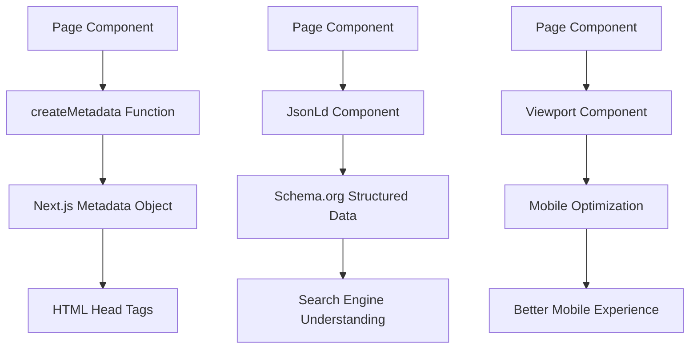

# @gabfon/seo Architecture

## Overview

The `@gabfon/seo` package provides comprehensive SEO utilities for Next.js applications, including JSON-LD structured data, metadata generation, and viewport configuration. It offers a streamlined approach to implementing SEO best practices with type-safe components and utilities.

## Architectural Decisions

### 1. Component-Based SEO Approach
- **Decision**: Create reusable React components for SEO elements
- **Rationale**: Leverages React's component model for consistent SEO implementation
- **Implementation**: JSON-LD component with schema-dts integration

### 2. Metadata Factory Pattern
- **Decision**: Use factory function for metadata generation
- **Rationale**: Ensures consistent SEO metadata across all pages
- **Implementation**: `createMetadata` function with sensible defaults

### 3. Schema.org Integration
- **Decision**: Use schema-dts for type-safe structured data
- **Rationale**: Provides TypeScript support for Schema.org vocabularies
- **Implementation**: Complete re-export of schema-dts types

### 4. Utility-First Design
- **Decision**: Focus on utility functions rather than complex abstractions
- **Rationale**: Provides maximum flexibility for different SEO needs
- **Implementation**: Simple, composable functions and components

## Module Organization

```
src/
├── json-ld.tsx        # JSON-LD structured data component
├── metadata.ts         # Metadata generation utilities
└── viewport.tsx        # Viewport meta tag component
```

## Data Flow



## Key Dependencies

### Core Dependencies
- **`react`**: React component support
- **`schema-dts`**: TypeScript definitions for Schema.org
- **`lodash.merge`**: Object merging utilities

### Next.js Integration
- **`next`**: Next.js metadata types and utilities

## SEO Architecture

### Metadata Generation

The package provides a factory function for generating comprehensive SEO metadata:

```typescript
export const createMetadata = ({
  title,
  description,
  image,
  ...properties
}: MetadataGenerator): Metadata
```

#### Default Metadata Structure

```typescript
const defaultMetadata: Metadata = {
  title,
  description,
  applicationName: 'Gabriel Fonseca',
  authors: [{ name: 'Gabriel Fonseca', url: 'https://gabfon.com/' }],
  creator: 'Gabriel Fonseca',
  formatDetection: { telephone: false },
  appleWebApp: {
    capable: true,
    statusBarStyle: 'default',
    title,
  },
  openGraph: {
    title,
    description,
    type: 'website',
    siteName: 'Gabriel Fonseca',
    locale: 'en_US',
  },
  publisher: 'Gabriel Fonseca',
  twitter: {
    card: 'summary_large_image',
    creator: '@gabfon_',
  },
};
```

### Structured Data

JSON-LD component for Schema.org structured data:

```typescript
export function JsonLd({ code }: JsonLdProps): JSX.Element
```

#### Features

- **Type Safety**: Full TypeScript support with schema-dts
- **Validation**: Ensures valid Schema.org markup
- **Flexibility**: Supports any Schema.org type
- **SEO Benefits**: Enhanced search engine understanding

### Viewport Configuration

Viewport meta tag component for mobile optimization:

```typescript
export function Viewport({ children }: ViewportProps): JSX.Element
```

#### Features

- **Mobile Optimization**: Proper viewport settings
- **Responsive Design**: Supports various screen sizes
- **Performance**: Optimized rendering

## Integration Patterns

### 1. Page Metadata

```typescript
// app/about/page.tsx
import { createMetadata } from '@gabfon/seo/metadata';

export const metadata = createMetadata({
  title: 'About Gabriel Fonseca',
  description: 'Learn about Gabriel Fonseca and his work.',
  image: '/images/about-og.jpg',
});

export default function AboutPage() {
  return <div>About content</div>;
}
```

### 2. Structured Data

```typescript
// app/blog/[slug]/page.tsx
import { JsonLd } from '@gabfon/seo/json-ld';
import type { BlogPosting } from 'schema-dts';

export default function BlogPostPage({ params }: { params: { slug: string } }) {
  const structuredData: BlogPosting = {
    '@type': 'BlogPosting',
    headline: 'Blog Post Title',
    description: 'Blog post description',
    author: {
      '@type': 'Person',
      name: 'Gabriel Fonseca',
    },
    datePublished: '2023-01-01',
  };

  return (
    <>
      <JsonLd code={structuredData} />
      <article>Blog content</article>
    </>
  );
}
```

### 3. Viewport Configuration

```typescript
// app/layout.tsx
import { Viewport } from '@gabfon/seo/viewport';

export const viewport: Viewport = {
  width: 'device-width',
  initialScale: 1,
  maximumScale: 5,
};

export default function RootLayout({ children }: { children: React.ReactNode }) {
  return (
    <html>
      <head>
        <Viewport />
      </head>
      <body>{children}</body>
    </html>
  );
}
```

## SEO Best Practices

### 1. Metadata Optimization

- **Title Tags**: Optimized length and keyword placement
- **Meta Descriptions**: Compelling descriptions within character limits
- **Open Graph**: Rich social media sharing
- **X Cards**: Enhanced X sharing

### 2. Structured Data

- **Schema.org**: Comprehensive structured data markup
- **Type Safety**: TypeScript validation for all schemas
- **Search Enhancement**: Better search engine understanding
- **Rich Snippets**: Enhanced search results

### 3. Mobile Optimization

- **Responsive Design**: Proper viewport configuration
- **Performance**: Optimized mobile experience
- **User Experience**: Better mobile interaction

## Performance Considerations

### 1. Bundle Size
- **Minimal Dependencies**: Only essential SEO libraries
- **Tree Shaking**: Unused code elimination
- **Component-Based**: Selective imports

### 2. Runtime Performance
- **Static Generation**: Pre-rendered SEO elements
- **Client-Side**: Minimal JavaScript overhead
- **Server-Side**: Optimized metadata generation

### 3. SEO Performance
- **Fast Loading**: Optimized meta tag rendering
- **Caching**: Browser caching support
- **CDN**: Content delivery optimization

## Environment Configuration

### No Required Environment Variables

The SEO package is designed to work without environment variables:

- **Static Configuration**: All settings are static
- **No External Dependencies**: No API keys or tokens needed
- **Zero Configuration**: Works out of the box

## Testing Strategy

### 1. Metadata Testing
- Test metadata generation accuracy
- Verify Open Graph tags
- Test X Card rendering

### 2. Structured Data Testing
- Validate JSON-LD syntax
- Test Schema.org compliance
- Verify structured data rendering

### 3. Integration Testing
- Test Next.js metadata integration
- Verify component rendering
- Test SEO tag generation

## Future Extensibility

The architecture supports:
- Additional metadata generators
- Custom schema types
- Advanced SEO utilities
- International SEO features
- Performance monitoring
- SEO analytics integration

## Migration Path

The package is designed to support:
- Easy adoption in existing projects
- Gradual feature implementation
- Backward compatibility maintenance
- SEO best practice updates
- Search engine algorithm changes

## Best Practices

### 1. SEO Implementation
- Use consistent metadata across pages
- Implement comprehensive structured data
- Optimize for mobile first
- Monitor SEO performance

### 2. Content Strategy
- Use descriptive titles and descriptions
- Implement relevant structured data
- Optimize images for SEO
- Create SEO-friendly URLs

### 3. Technical SEO
- Ensure proper meta tag hierarchy
- Validate structured data regularly
- Monitor page load speed
- Test on various devices

### 4. Analytics Integration
- Track SEO performance metrics
- Monitor search engine rankings
- Analyze user behavior
- Optimize based on data
