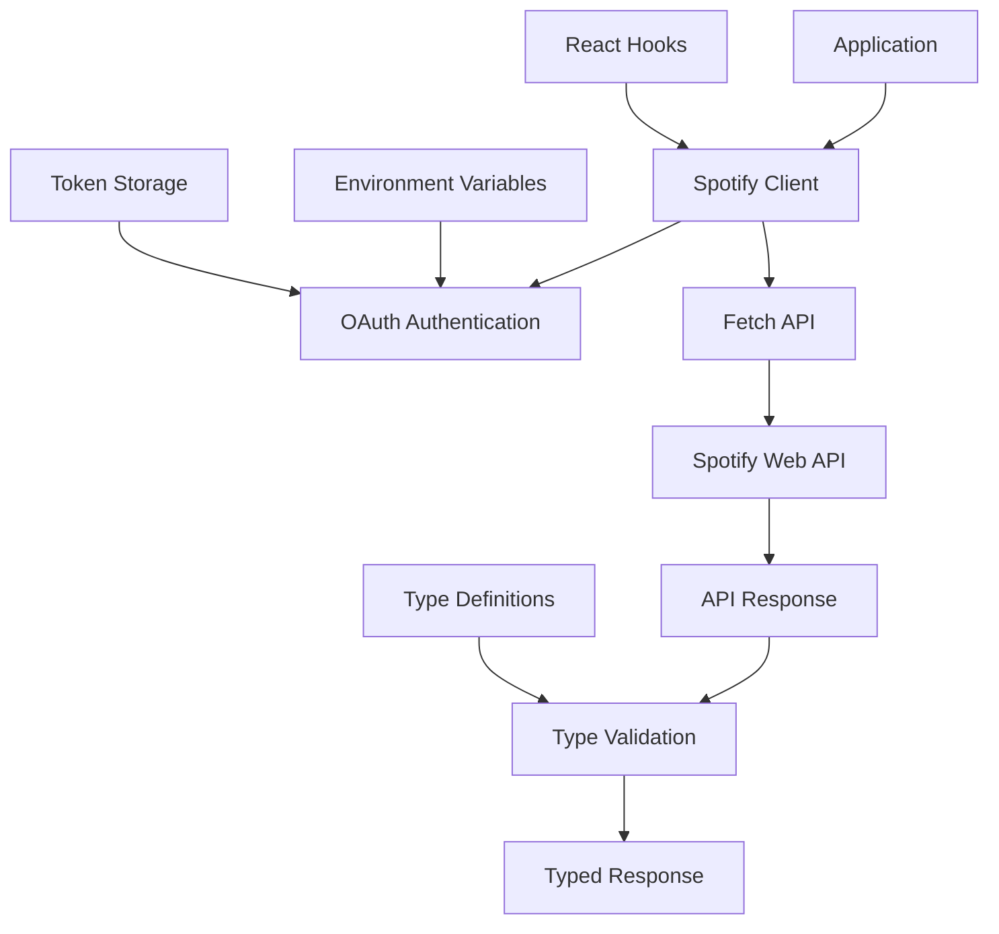

# @gabfon/spotify Architecture

## Overview

The `@gabfon/spotify` package provides a comprehensive Spotify Web API client built on modern web standards. It offers type-safe access to Spotify's API with support for artists, tracks, audio features, user data, and playback information, with built-in error handling and OAuth authentication.

## Architectural Decisions

### 1. REST API Client Pattern
- **Decision**: Implement a REST API client using native fetch
- **Rationale**: Leverages modern browser APIs with no external dependencies
- **Implementation**: Type-safe client with comprehensive error handling

### 2. OAuth 2.0 Authentication
- **Decision**: Implement Spotify's OAuth 2.0 authorization flow
- **Rationale**: Secure authentication with proper token management
- **Implementation**: Authorization code flow with refresh token support

### 3. Type-First Development
- **Decision**: Use TypeScript interfaces for all API responses
- **Rationale**: Ensures type safety and better developer experience
- **Implementation**: Comprehensive type definitions for Spotify API objects

### 4. Modular Client Architecture
- **Decision**: Organize client methods by Spotify API categories
- **Rationale**: Provides clear separation of concerns and maintainability
- **Implementation**: Grouped methods for artists, tracks, users, etc.

## Module Organization

```
src/
├── index.ts           # Main client exports
├── client.ts          # Spotify API client implementation
├── types/             # TypeScript type definitions
│   ├── index.ts       # Type exports
│   ├── api.ts         # API response types
│   ├── artists.ts     # Artist-related types
│   ├── tracks.ts      # Track-related types
│   ├── albums.ts      # Album-related types
│   ├── audio.ts       # Audio feature types
│   ├── playback.ts    # Playback-related types
│   └── users.ts       # User-related types
├── hooks/             # React hooks
│   └── index.ts       # Hook exports
└── keys.ts            # Environment variable validation
```

## Data Flow



## Key Dependencies

### Core Dependencies
- **`react`**: React hooks support
- **`zod`**: Runtime type validation

### Configuration Dependencies
- **`@t3-oss/env-nextjs`**: Environment variable validation
- **`@gabfon/analytics`**: Optional analytics integration
- **`@gabfon/testing`**: Testing utilities

## Authentication Architecture

### OAuth 2.0 Flow

The package implements Spotify's Authorization Code Flow:

```typescript
class SpotifyAuth {
  private clientId: string;
  private clientSecret: string;
  private redirectUri: string;

  async getAuthorizationUrl(scopes: string[]): Promise<string>;
  async exchangeCodeForToken(code: string): Promise<SpotifyTokens>;
  async refreshToken(refreshToken: string): Promise<SpotifyTokens>;
}
```

### Token Management

```typescript
interface SpotifyTokens {
  access_token: string;
  token_type: string;
  scope: string;
  expires_in: number;
  refresh_token?: string;
}
```

## Client Architecture

### Spotify Client

The main client class provides methods for interacting with Spotify's API:

```typescript
class SpotifyClient {
  private accessToken: string;
  private refreshToken?: string;

  constructor(tokens: SpotifyTokens);

  // Artist methods
  async getArtist(artistId: string): Promise<SpotifyArtist>;
  async getArtistAlbums(artistId: string): Promise<SpotifyAlbum[]>;
  async getArtistTopTracks(artistId: string): Promise<SpotifyTrack[]>;
  
  // Track methods
  async getTrack(trackId: string): Promise<SpotifyTrack>;
  async getAudioFeatures(trackId: string): Promise<AudioFeatures>;
  async getAudioAnalysis(trackId: string): Promise<AudioAnalysis>;
  
  // User methods
  async getCurrentUser(): Promise<SpotifyUser>;
  async getUserTopTracks(timeRange?: TimeRange): Promise<SpotifyTrack[]>;
  async getUserTopArtists(timeRange?: TimeRange): Promise<SpotifyArtist[]>;
  
  // Playback methods
  async getCurrentlyPlaying(): Promise<CurrentlyPlaying>;
  async getRecentlyPlayed(): Promise<PlayHistory[]>;
  async getPlaybackState(): Promise<PlaybackState>;
}
```

### Environment Configuration

```typescript
export const keys = () =>
  createEnv({
    server: {
      SPOTIFY_CLIENT_ID: z.string(),
      SPOTIFY_CLIENT_SECRET: z.string(),
      SPOTIFY_REDIRECT_URI: z.string().url(),
    },
    client: {
      NEXT_PUBLIC_SPOTIFY_CLIENT_ID: z.string(),
    },
    runtimeEnv: {
      SPOTIFY_CLIENT_ID: process.env.SPOTIFY_CLIENT_ID,
      SPOTIFY_CLIENT_SECRET: process.env.SPOTIFY_CLIENT_SECRET,
      SPOTIFY_REDIRECT_URI: process.env.SPOTIFY_REDIRECT_URI,
      NEXT_PUBLIC_SPOTIFY_CLIENT_ID: process.env.NEXT_PUBLIC_SPOTIFY_CLIENT_ID,
    },
    emptyStringAsUndefined: true,
    skipValidation: !process.env.SKIP_ENV_VALIDATION,
  });
```

## Type System

### API Response Types

Comprehensive TypeScript interfaces for Spotify API responses:

```typescript
interface SpotifyArtist {
  id: string;
  name: string;
  type: 'artist';
  uri: string;
  href: string;
  external_urls: ExternalUrls;
  followers: Followers;
  genres: string[];
  popularity: number;
  images: Image[];
}

interface SpotifyTrack {
  id: string;
  name: string;
  type: 'track';
  uri: string;
  href: string;
  external_urls: ExternalUrls;
  duration_ms: number;
  explicit: boolean;
  popularity: number;
  album: SimplifiedAlbum;
  artists: SimplifiedArtist[];
  external_ids: ExternalIds;
  preview_url: string | null;
}

interface AudioFeatures {
  acousticness: number;
  danceability: number;
  energy: number;
  instrumentalness: number;
  key: number;
  liveness: number;
  loudness: number;
  mode: number;
  speechiness: number;
  tempo: number;
  time_signature: number;
  valence: number;
}
```

## Integration Patterns

### 1. Basic Client Usage

```typescript
import { SpotifyClient } from '@gabfon/spotify';

const client = new SpotifyClient({
  access_token: 'your_access_token',
  refresh_token: 'your_refresh_token',
});

const artist = await client.getArtist('artist-id');
const tracks = await client.getArtistTopTracks('artist-id');
```

### 2. React Hook Integration

```typescript
import { useSpotifyArtist, useSpotifyTrack } from '@gabfon/spotify/hooks';

function ArtistProfile({ artistId }: { artistId: string }) {
  const { data: artist, loading, error } = useSpotifyArtist(artistId);
  const { data: topTracks } = useSpotifyArtistTopTracks(artistId);

  if (loading) return <div>Loading...</div>;
  if (error) return <div>Error: {error.message}</div>;

  return (
    <div>
      <h1>{artist?.name}</h1>
      <p>Genres: {artist?.genres.join(', ')}</p>
      <h2>Top Tracks</h2>
    </div>
  );
}
```

### 3. Server-Side Usage

```typescript
// app/api/spotify/artist/[id]/route.ts
import { spotifyClient } from '@gabfon/spotify';

export async function GET(
  request: Request,
  { params }: { params: { id: string } }
) {
  try {
    const artist = await spotifyClient.getArtist(params.id);
    return Response.json(artist);
  } catch (error) {
    return Response.json(
      { error: 'Artist not found' },
      { status: 404 }
    );
  }
}
```

## Error Handling

### HTTP Error Handling

The client provides comprehensive error handling for various scenarios:

```typescript
class SpotifyClient {
  private async handleResponse<T>(response: Response): Promise<T> {
    if (!response.ok) {
      if (response.status === 401) {
        throw new Error('Unauthorized - check access token');
      }
      if (response.status === 403) {
        throw new Error('Forbidden - insufficient permissions');
      }
      if (response.status === 429) {
        const retryAfter = response.headers.get('Retry-After');
        throw new Error(`Rate limit exceeded - retry after ${retryAfter}s`);
      }
      throw new Error(`Spotify API error: ${response.status}`);
    }

    return response.json();
  }
}
```

### Token Refresh

```typescript
class SpotifyClient {
  private async ensureValidToken(): Promise<void> {
    if (this.isTokenExpired()) {
      if (this.refreshToken) {
        const tokens = await this.refreshToken(this.refreshToken);
        this.updateTokens(tokens);
      } else {
        throw new Error('No refresh token available');
      }
    }
  }
}
```

## Performance Considerations

### 1. Request Optimization
- **Conditional Requests**: Use ETags for caching
- **Pagination**: Implement proper pagination for large datasets
- **Rate Limiting**: Respect Spotify's rate limits
- **Batching**: Combine multiple requests when possible

### 2. Memory Management
- **Stream Processing**: Use streaming for large responses
- **Response Caching**: Implement client-side caching
- **Lazy Loading**: Load data only when needed

### 3. React Integration
- **Memoization**: Cache API responses in hooks
- **Suspense**: Use React Suspense for data fetching
- **Error Boundaries**: Handle errors gracefully

## Security Considerations

### 1. Token Management
- **Server-Side Tokens**: Store tokens securely on server
- **Client-Side Tokens**: Use short-lived tokens on client
- **Token Rotation**: Regularly refresh access tokens
- **Scope Limitation**: Use minimal required scopes

### 2. Data Protection
- **Input Validation**: Validate all user inputs
- **Output Sanitization**: Sanitize API responses
- **Error Information**: Avoid exposing sensitive information in errors

### 3. API Security
- **HTTPS Only**: Use HTTPS for all API requests
- **CORS Handling**: Proper CORS configuration
- **Rate Limiting**: Implement client-side throttling

## Testing Strategy

### 1. Unit Testing
- Test client methods with mocked responses
- Test error handling scenarios
- Test type validation

### 2. Integration Testing
- Test with actual Spotify API (using test tokens)
- Test React hooks with test components
- Test authentication flows

### 3. Performance Testing
- Test response times
- Test memory usage
- Test rate limiting behavior

## Future Extensibility

The architecture supports:
- Additional Spotify API endpoints
- GraphQL API integration
- Real-time playback controls
- Web API playback SDK
- Advanced audio analysis
- Playlist management
- Social features

## Migration Path

The package is designed to support:
- Easy adoption in existing projects
- Gradual feature implementation
- Backward compatibility maintenance
- API version updates
- Breaking change management

## Best Practices

### 1. Client Usage
- Use appropriate error handling
- Implement proper caching
- Respect rate limits
- Use TypeScript for type safety

### 2. React Integration
- Use provided hooks for consistency
- Implement loading states
- Handle errors gracefully
- Use Suspense for better UX

### 3. Authentication
- Never expose client secret on client-side
- Use secure token storage
- Implement proper token refresh
- Use minimal required scopes

### 4. Performance
- Cache responses when appropriate
- Use pagination for large datasets
- Implement lazy loading
- Monitor rate limit usage
