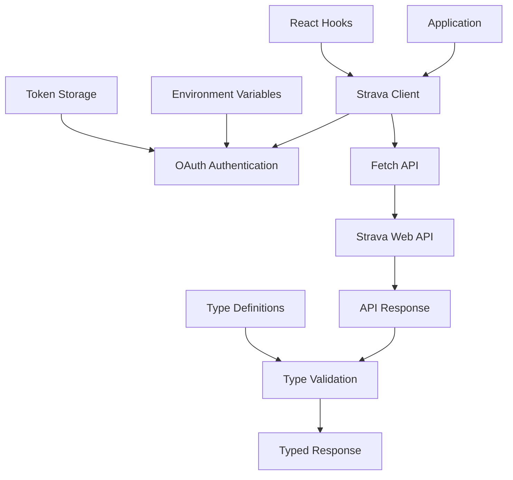

# @gabfon/strava Architecture

## Overview

The `@gabfon/strava` package provides a comprehensive Strava API client built on modern web standards. It offers type-safe access to Strava's API with support for athletes, activities, stats, and achievements, with built-in OAuth authentication and token management.

## Architectural Decisions

### 1. REST API Client Pattern
- **Decision**: Implement a REST API client using native fetch
- **Rationale**: Leverages modern browser APIs with no external dependencies
- **Implementation**: Type-safe client with comprehensive error handling

### 2. OAuth 2.0 Authentication
- **Decision**: Implement Strava's OAuth 2.0 authorization flow
- **Rationale**: Secure authentication with proper token management
- **Implementation**: Authorization code flow with refresh token support

### 3. Type-First Development
- **Decision**: Use TypeScript interfaces for all API responses
- **Rationale**: Ensures type safety and better developer experience
- **Implementation**: Comprehensive type definitions for Strava API objects

### 4. Modular Client Architecture
- **Decision**: Organize client methods by Strava API categories
- **Rationale**: Provides clear separation of concerns and maintainability
- **Implementation**: Grouped methods for athletes, activities, etc.

## Module Organization

```
src/
├── index.ts           # Main client exports
├── client.ts          # Strava API client implementation
├── types/             # TypeScript type definitions
│   ├── index.ts       # Type exports
│   ├── api.ts         # API response types
│   ├── athletes.ts    # Athlete-related types
│   ├── activities.ts  # Activity-related types
│   ├── achievements.ts # Achievement types
│   └── stats.ts       # Statistics types
├── hooks/             # React hooks
│   └── index.ts       # Hook exports
└── keys.ts            # Environment variable validation
```

## Data Flow



## Key Dependencies

### Core Dependencies
- **`react`**: React hooks support
- **`zod`**: Runtime type validation

### Configuration Dependencies
- **`@t3-oss/env-nextjs`**: Environment variable validation
- **`@gabfon/analytics`**: Optional analytics integration
- **`@gabfon/testing`**: Testing utilities

## Authentication Architecture

### OAuth 2.0 Flow

The package implements Strava's Authorization Code Flow:

```typescript
class StravaAuth {
  private clientId: string;
  private clientSecret: string;
  private redirectUri: string;

  async getAuthorizationUrl(scopes: string[]): Promise<string>;
  async exchangeCodeForToken(code: string): Promise<StravaTokens>;
  async refreshToken(refreshToken: string): Promise<StravaTokens>;
}
```

### Token Management

```typescript
interface StravaTokens {
  token_type: string;
  access_token: string;
  expires_at: number;
  refresh_token: string;
  athlete: StravaAthlete;
}
```

## Client Architecture

### Strava Client

The main client class provides methods for interacting with Strava's API:

```typescript
class StravaClient {
  private accessToken: string;
  private refreshToken?: string;
  private athlete?: StravaAthlete;

  constructor(tokens: StravaTokens);

  // Athlete methods
  async getCurrentAthlete(): Promise<StravaAthlete>;
  async getAthleteStats(athleteId: string): Promise<AthleteStats>;
  async getAthleteActivities(athleteId: string, options?: ActivityOptions): Promise<StravaActivity[]>;
  
  // Activity methods
  async getActivity(activityId: string): Promise<StravaActivity>;
  async getActivityStreams(activityId: string, types: StreamType[]): Promise<ActivityStreams>;
  
  // Achievement methods
  async getAthleteAchievements(athleteId: string): Promise<Achievement[]>;
  
  // Club methods
  async getClub(clubId: string): Promise<Club>;
  async getClubMembers(clubId: string): Promise<ClubMember[]>;
}
```

### Environment Configuration

```typescript
export const keys = () =>
  createEnv({
    server: {
      STRAVA_CLIENT_ID: z.string(),
      STRAVA_CLIENT_SECRET: z.string(),
      STRAVA_REDIRECT_URI: z.string().url(),
    },
    client: {
      NEXT_PUBLIC_STRAVA_CLIENT_ID: z.string(),
    },
    runtimeEnv: {
      STRAVA_CLIENT_ID: process.env.STRAVA_CLIENT_ID,
      STRAVA_CLIENT_SECRET: process.env.STRAVA_CLIENT_SECRET,
      STRAVA_REDIRECT_URI: process.env.STRAVA_REDIRECT_URI,
      NEXT_PUBLIC_STRAVA_CLIENT_ID: process.env.NEXT_PUBLIC_STRAVA_CLIENT_ID,
    },
    emptyStringAsUndefined: true,
    skipValidation: !process.env.SKIP_ENV_VALIDATION,
  });
```

## Type System

### API Response Types

Comprehensive TypeScript interfaces for Strava API responses:

```typescript
interface StravaAthlete {
  id: number;
  username: string;
  resource_state: number;
  firstname: string;
  lastname: string;
  city: string;
  state: string;
  country: string;
  sex: string;
  premium: boolean;
  created_at: string;
  updated_at: string;
  badge_type_id: number;
  profile_medium: string;
  profile: string;
  friend: string;
  follower: string;
  follower_count: number;
  friend_count: number;
  mutual_friend_count: number;
  athlete_type: AthleteType;
  date_preference: string;
  measurement_preference: string;
  clubs: Club[];
  bikes: Bike[];
  shoes: Shoe[];
}

interface StravaActivity {
  id: number;
  resource_state: number;
  external_id: string;
  upload_id: number;
  athlete: StravaAthlete;
  name: string;
  distance: number;
  moving_time: number;
  elapsed_time: number;
  total_elevation_gain: number;
  type: ActivityType;
  sport_type: SportType;
  workout_type: number;
  id: number;
  start_date: string;
  start_date_local: string;
  timezone: string;
  utc_offset: number;
  start_latlng: number[];
  end_latlng: number[];
  location_city: string;
  location_state: string;
  location_country: string;
  achievement_count: number;
  kudos_count: number;
  comment_count: number;
  athlete_count: number;
  photo_count: number;
  map: ActivityMap;
  trainer: boolean;
  commute: boolean;
  manual: boolean;
  private: boolean;
  flagged: boolean;
  gear_id: string;
  device_name: string;
  embed_token: string;
  from_accepted_tag: boolean;
  average_speed: number;
  max_speed: number;
  average_cadence: number;
  average_watts: number;
  weighted_average_watts: number;
  device_watts: boolean;
  max_watts: number;
  description: string;
  photos: ActivityPhoto[];
  calories: number;
  total_photo_count: number;
  has_kudoed: boolean;
  suffer_score: number;
}

interface AthleteStats {
  biggest_ride_distance: number;
  biggest_climb_elevation_gain: number;
  recent_ride_totals: RecentTotals;
  recent_run_totals: RecentTotals;
  ytd_ride_totals: YtdTotals;
  ytd_run_totals: YtdTotals;
  all_ride_totals: AllTotals;
  all_run_totals: AllTotals;
}
```

## Integration Patterns

### 1. Basic Client Usage

```typescript
import { StravaClient } from '@gabfon/strava';

const client = new StravaClient({
  access_token: 'your_access_token',
  refresh_token: 'your_refresh_token',
});

const athlete = await client.getCurrentAthlete();
const stats = await client.getAthleteStats(athlete.id);
```

### 2. React Hook Integration

```typescript
import { useStravaAthlete, useStravaActivities } from '@gabfon/strava/hooks';

function AthleteProfile({ athleteId }: { athleteId: string }) {
  const { data: athlete, loading, error } = useStravaAthlete(athleteId);
  const { data: activities } = useStravaActivities(athleteId);

  if (loading) return <div>Loading...</div>;
  if (error) return <div>Error: {error.message}</div>;

  return (
    <div>
      <h1>{athlete?.firstname} {athlete?.lastname}</h1>
      <p>Location: {athlete?.city}, {athlete?.state}</p>
      <h2>Recent Activities ({activities?.length})</h2>
    </div>
  );
}
```

### 3. Server-Side Usage

```typescript
// app/api/strava/athlete/[id]/route.ts
import { stravaClient } from '@gabfon/strava';

export async function GET(
  request: Request,
  { params }: { params: { id: string } }
) {
  try {
    const athlete = await stravaClient.getAthlete(params.id);
    return Response.json(athlete);
  } catch (error) {
    return Response.json(
      { error: 'Athlete not found' },
      { status: 404 }
    );
  }
}
```

## Error Handling

### HTTP Error Handling

The client provides comprehensive error handling for various scenarios:

```typescript
class StravaClient {
  private async handleResponse<T>(response: Response): Promise<T> {
    if (!response.ok) {
      if (response.status === 401) {
        throw new Error('Unauthorized - check access token');
      }
      if (response.status === 403) {
        throw new Error('Forbidden - insufficient permissions');
      }
      if (response.status === 429) {
        const rateLimit = response.headers.get('X-RateLimit-Limit');
        throw new Error(`Rate limit exceeded: ${rateLimit}`);
      }
      throw new Error(`Strava API error: ${response.status}`);
    }

    return response.json();
  }
}
```

### Token Refresh

```typescript
class StravaClient {
  private async ensureValidToken(): Promise<void> {
    if (this.isTokenExpired()) {
      if (this.refreshToken) {
        const tokens = await this.refreshToken(this.refreshToken);
        this.updateTokens(tokens);
      } else {
        throw new Error('No refresh token available');
      }
    }
  }
}
```

## Performance Considerations

### 1. Request Optimization
- **Conditional Requests**: Use ETags for caching
- **Pagination**: Implement proper pagination for large datasets
- **Rate Limiting**: Respect Strava's rate limits (200 requests per 15 minutes)
- **Batching**: Combine multiple requests when possible

### 2. Memory Management
- **Stream Processing**: Use streaming for large responses
- **Response Caching**: Implement client-side caching
- **Lazy Loading**: Load data only when needed

### 3. React Integration
- **Memoization**: Cache API responses in hooks
- **Suspense**: Use React Suspense for data fetching
- **Error Boundaries**: Handle errors gracefully

## Security Considerations

### 1. Token Management
- **Server-Side Tokens**: Store tokens securely on server
- **Client-Side Tokens**: Use short-lived tokens on client
- **Token Rotation**: Regularly refresh access tokens
- **Scope Limitation**: Use minimal required scopes

### 2. Data Protection
- **Input Validation**: Validate all user inputs
- **Output Sanitization**: Sanitize API responses
- **Error Information**: Avoid exposing sensitive information in errors

### 3. API Security
- **HTTPS Only**: Use HTTPS for all API requests
- **CORS Handling**: Proper CORS configuration
- **Rate Limiting**: Implement client-side throttling

## Testing Strategy

### 1. Unit Testing
- Test client methods with mocked responses
- Test error handling scenarios
- Test type validation

### 2. Integration Testing
- Test with actual Strava API (using test tokens)
- Test React hooks with test components
- Test authentication flows

### 3. Performance Testing
- Test response times
- Test memory usage
- Test rate limiting behavior

## Future Extensibility

The architecture supports:
- Additional Strava API endpoints
- Real-time activity tracking
- Advanced analytics features
- Social features
- Route planning
- Training plans
- Equipment management

## Migration Path

The package is designed to support:
- Easy adoption in existing projects
- Gradual feature implementation
- Backward compatibility maintenance
- API version updates
- Breaking change management

## Best Practices

### 1. Client Usage
- Use appropriate error handling
- Implement proper caching
- Respect rate limits
- Use TypeScript for type safety

### 2. React Integration
- Use provided hooks for consistency
- Implement loading states
- Handle errors gracefully
- Use Suspense for better UX

### 3. Authentication
- Never expose client secret on client-side
- Use secure token storage
- Implement proper token refresh
- Use minimal required scopes

### 4. Performance
- Cache responses when appropriate
- Use pagination for large datasets
- Implement lazy loading
- Monitor rate limit usage
