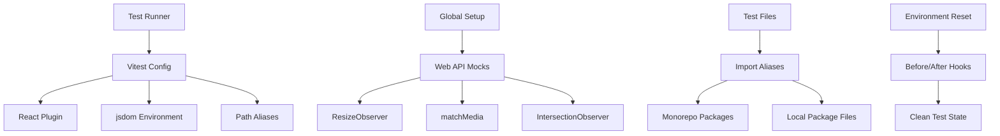

# @gabfon/testing Architecture

## Overview

The `@gabfon/testing` package provides a comprehensive testing setup for the monorepo, including Vitest configuration, shared testing utilities, and global test setup. It ensures consistent testing practices across all packages with proper browser environment simulation and monorepo-specific configurations.

## Architectural Decisions

### 1. Vitest-Based Testing Framework
- **Decision**: Use Vitest as the primary testing framework
- **Rationale**: Fast, modern testing with excellent TypeScript support and Vite integration
- **Implementation**: Pre-configured Vitest setup with React support

### 2. Browser Environment Simulation
- **Decision**: Use jsdom for browser-like testing environment
- **Rationale**: Enables DOM testing without actual browser overhead
- **Implementation**: Global jsdom environment with necessary Web API mocks

### 3. Monorepo-Aware Configuration
- **Decision**: Implement path aliases for easy package imports
- **Rationale**: Simplifies testing across monorepo packages
- **Implementation**: Configured aliases for @ and @gabfon imports

### 4. Global Test Setup
- **Decision**: Provide comprehensive global test utilities
- **Rationale**: Reduces boilerplate and ensures consistent test environment
- **Implementation**: Mocked Web APIs and environment handling

## Module Organization

```
src/
├── index.d.ts          # TypeScript type definitions
├── index.mjs           # Vitest configuration (ESM)
└── setup.ts            # Global test setup utilities
```

## Data Flow



## Key Dependencies

### Testing Framework
- **`vitest`**: Modern testing framework
- **`@vitejs/plugin-react`**: React support for Vite/Vitest
- **`jsdom`**: DOM environment simulation

### Testing Utilities
- **`@testing-library/react`**: React testing utilities
- **`@testing-library/jest-dom`**: DOM testing matchers

### Development Dependencies
- **`typescript`**: TypeScript support
- **`vite`**: Build tool and development server

## Configuration Architecture

### Vitest Configuration

The package provides a comprehensive Vitest configuration:

```typescript
export const testingConfig = defineConfig({
  plugins: [react()],
  test: {
    environment: 'jsdom',
  },
  resolve: {
    alias: {
      '@': path.resolve(Dirname, './'),
      '@gabfon': path.resolve(Dirname, '../../packages'),
    },
  },
});
```

#### Key Features

- **React Plugin**: Enables JSX and React component testing
- **jsdom Environment**: Browser-like DOM for testing
- **Path Aliases**: Simplified imports across monorepo
- **TypeScript Support**: Full TypeScript integration

### Global Test Setup

Comprehensive Web API mocking for consistent testing:

```typescript
// ResizeObserver mock
global.ResizeObserver = vi.fn().mockImplementation(() => ({
  observe: vi.fn(),
  unobserve: vi.fn(),
  disconnect: vi.fn(),
}));

// matchMedia mock
Object.defineProperty(window, 'matchMedia', {
  writable: true,
  value: vi.fn().mockImplementation((query: string) => ({
    matches: false,
    media: query,
    onchange: null,
    addListener: vi.fn(),
    removeListener: vi.fn(),
    addEventListener: vi.fn(),
    removeEventListener: vi.fn(),
    dispatchEvent: vi.fn(),
  })),
});

// IntersectionObserver mock
global.IntersectionObserver = vi.fn().mockImplementation(() => ({
  observe: vi.fn(),
  unobserve: vi.fn(),
  disconnect: vi.fn(),
}));
```

## Integration Patterns

### 1. Package-Level Testing

```typescript
// packages/example/__tests__/component.test.tsx
import { render, screen } from '@testing-library/react';
import { describe, it, expect } from 'vitest';
import { MyComponent } from '@/components/MyComponent';

describe('MyComponent', () => {
  it('renders correctly', () => {
    render(<MyComponent />);
    expect(screen.getByText('Hello World')).toBeInTheDocument();
  });
});
```

### 2. Cross-Package Testing

```typescript
// packages/example/__tests__/integration.test.tsx
import { render, screen } from '@testing-library/react';
import { Button } from '@gabfon/design-system';
import { AnalyticsProvider } from '@gabfon/analytics';

describe('Integration Test', () => {
  it('integrates with other packages', () => {
    render(
      <AnalyticsProvider>
        <Button>Click me</Button>
      </AnalyticsProvider>
    );
    
    expect(screen.getByRole('button')).toBeInTheDocument();
  });
});
```

### 3. Configuration Usage

```typescript
// vitest.config.ts
import { testingConfig } from '@gabfon/testing';

export default testingConfig;
```

## Testing Environment Setup

### Browser API Mocks

The package provides comprehensive mocking for modern Web APIs:

#### ResizeObserver
- **Purpose**: Mocks element resize observation
- **Implementation**: No-op functions with proper interface
- **Use Case**: Testing responsive components

#### matchMedia
- **Purpose**: Mocks media query matching
- **Implementation**: Returns false for all queries by default
- **Use Case**: Testing responsive behavior

#### IntersectionObserver
- **Purpose**: Mocks element intersection observation
- **Implementation**: No-op functions with proper interface
- **Use Case**: Testing scroll-based components

### Environment Management

#### Process Environment Reset

```typescript
const originalEnv = process.env;
beforeEach(() => {
  vi.resetModules();
  process.env = { ...originalEnv };
});

afterEach(() => {
  process.env = originalEnv;
});
```

**Purpose**: Ensures clean environment for each test
**Implementation**: Reset modules and environment variables
**Use Case**: Testing environment-dependent code

## Performance Considerations

### 1. Test Execution Speed
- **Vitest**: Fast test runner with intelligent caching
- **jsdom**: Lightweight DOM simulation
- **Mocked APIs**: Minimal overhead from Web API mocks

### 2. Memory Usage
- **Module Reset**: Prevents memory leaks between tests
- **Mock Functions**: Efficient function mocking
- **Environment Cleanup**: Proper resource cleanup

### 3. Development Experience
- **Hot Reloading**: Fast test re-execution
- **TypeScript**: Immediate type feedback
- **Path Aliases**: Simplified imports

## Testing Strategy

### 1. Unit Testing
- Component isolation
- Function testing
- Utility function testing

### 2. Integration Testing
- Package integration
- Component composition
- API integration

### 3. End-to-End Testing
- User flows
- Cross-package workflows
- Browser behavior simulation

## Best Practices

### 1. Test Organization
- **File Structure**: `__tests__` directories
- **Naming Convention**: `*.test.ts` or `*.test.tsx`
- **Test Groups**: Logical grouping with `describe`

### 2. Test Writing
- **AAA Pattern**: Arrange, Act, Assert
- **Descriptive Tests**: Clear test descriptions
- **Focused Tests**: Single assertion per test

### 3. Mock Management
- **Global Mocks**: Common Web API mocks
- **Local Mocks**: Test-specific mocks
- **Mock Cleanup**: Proper cleanup after tests

## Future Extensibility

The architecture supports:
- Additional testing utilities
- Custom matchers
- Test environment extensions
- Performance testing tools
- Visual regression testing
- Accessibility testing integration

## Migration Path

The package is designed to support:
- Easy adoption in existing projects
- Gradual test migration
- Framework switching support
- Configuration updates
- Best practice evolution

## Integration Examples

### With Design System Package

```typescript
// packages/design-system/__tests__/Button.test.tsx
import { render, screen } from '@testing-library/react';
import { describe, it, expect } from 'vitest';
import { Button } from '@/components/button';

describe('Button Component', () => {
  it('renders with correct text', () => {
    render(<Button>Click me</Button>);
    expect(screen.getByRole('button')).toHaveTextContent('Click me');
  });

  it('applies variant classes', () => {
    render(<Button variant="destructive">Delete</Button>);
    const button = screen.getByRole('button');
    expect(button).toHaveClass('bg-destructive');
  });
});
```

### With Analytics Package

```typescript
// packages/analytics/__tests__/provider.test.tsx
import { render, screen } from '@testing-library/react';
import { describe, it, expect, vi } from 'vitest';
import { AnalyticsProvider } from '@/index';

// Mock PostHog
vi.mock('posthog-js/react', () => ({
  PostHogProvider: ({ children }: { children: React.ReactNode }) => children,
  usePostHog: () => ({
    track: vi.fn(),
    identify: vi.fn(),
  }),
}));

describe('AnalyticsProvider', () => {
  it('renders children', () => {
    render(
      <AnalyticsProvider>
        <div>Test Content</div>
      </AnalyticsProvider>
    );
    
    expect(screen.getByText('Test Content')).toBeInTheDocument();
  });
});
```

### With API Packages

```typescript
// packages/github/__tests__/client.test.ts
import { describe, it, expect, vi } from 'vitest';
import { githubClient } from '@/client';

// Mock fetch
global.fetch = vi.fn();

describe('GitHub Client', () => {
  it('fetches user data', async () => {
    const mockUser = { id: 1, name: 'Test User' };
    (fetch as any).mockResolvedValueOnce({
      json: () => Promise.resolve(mockUser),
    });

    const user = await githubClient.getUser('testuser');
    expect(user).toEqual(mockUser);
  });
});
```

## Performance Monitoring

### Test Performance Tracking

```typescript
// __tests__/performance.test.ts
import { describe, it, expect } from 'vitest';

describe('Performance Tests', () => {
  it('renders component within performance budget', async () => {
    const startTime = performance.now();
    
    // Component rendering test
    render(<ExpensiveComponent />);
    
    const endTime = performance.now();
    const renderTime = endTime - startTime;
    
    expect(renderTime).toBeLessThan(100); // 100ms budget
  });
});
```

## Continuous Integration

### CI Configuration

```yaml
# .github/workflows/test.yml
name: Test
on: [push, pull_request]

jobs:
  test:
    runs-on: ubuntu-latest
    steps:
      - uses: actions/checkout@v3
      - uses: actions/setup-node@v3
      - run: npm ci
      - run: npm run test
      - run: npm run test:coverage
```

### Coverage Reporting

```typescript
// vitest.config.ts
import { testingConfig } from '@gabfon/testing';

export default {
  ...testingConfig,
  test: {
    ...testingConfig.test,
    coverage: {
      reporter: ['text', 'json', 'html'],
      exclude: [
        'node_modules/',
        '__tests__/',
        '**/*.test.ts',
        '**/*.test.tsx',
      ],
    },
  },
};
```
