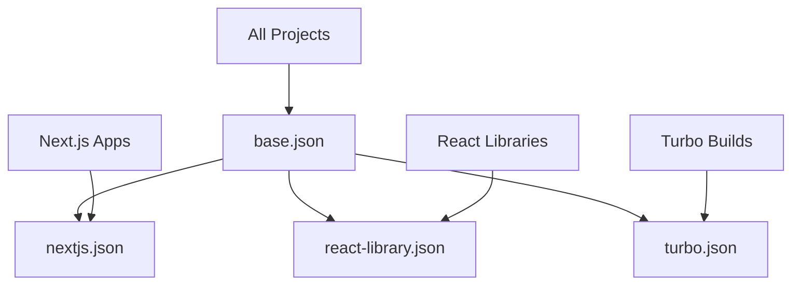

# @gabfon/typescript-config Architecture

## Overview

The `@gabfon/typescript-config` package provides shared TypeScript configuration files for the monorepo, ensuring consistent compiler settings across all packages. It offers specialized configurations for different project types including base settings, Next.js applications, React libraries, and Turbo builds.

## Architectural Decisions

### 1. Configuration Inheritance Pattern
- **Decision**: Use TypeScript configuration inheritance for shared settings
- **Rationale**: Reduces duplication while maintaining flexibility
- **Implementation**: Base configuration with specialized extensions

### 2. Project-Specific Configurations
- **Decision**: Create tailored configurations for different project types
- **Rationale**: Different projects have different TypeScript requirements
- **Implementation**: Separate configs for Next.js, React libraries, and Turbo

### 3. Modern TypeScript Standards
- **Decision**: Use latest TypeScript features and best practices
- **Rationale**: Ensures type safety and modern JavaScript support
- **Implementation**: ES2022 target with strict mode enabled

### 4. Monorepo Path Mapping
- **Decision**: Configure path aliases for monorepo package imports
- **Rationale**: Simplifies cross-package imports and development
- **Implementation**: Configured path mappings in Next.js config

## Module Organization

```
packages/typescript-config/
├── base.json           # Base TypeScript configuration
├── nextjs.json         # Next.js specific configuration
├── react-library.json  # React library configuration
├── turbo.json          # Turbo build configuration
├── package.json        # Package metadata
└── README.md          # Usage documentation
```

## Configuration Architecture

### Base Configuration (`base.json`)

The foundation configuration that all other configs extend:

```json
{
  "$schema": "https://json.schemastore.org/tsconfig",
  "display": "Default",
  "compilerOptions": {
    "declaration": true,
    "declarationMap": true,
    "esModuleInterop": true,
    "forceConsistentCasingInFileNames": true,
    "incremental": false,
    "isolatedModules": true,
    "lib": ["es2022", "DOM", "DOM.Iterable"],
    "module": "NodeNext",
    "moduleDetection": "force",
    "moduleResolution": "NodeNext",
    "resolveJsonModule": true,
    "skipLibCheck": true,
    "strict": true,
    "target": "ES2022",
    "strictNullChecks": true
  }
}
```

#### Key Features

- **Strict Mode**: Full TypeScript strict mode enabled
- **Modern Target**: ES2022 for latest JavaScript features
- **Module Resolution**: NodeNext for modern module handling
- **Declaration Generation**: Full declaration support for libraries

### Next.js Configuration (`nextjs.json`)

Extended configuration for Next.js applications:

```json
{
  "$schema": "https://json.schemastore.org/tsconfig",
  "display": "Next.js",
  "extends": "./base.json",
  "compilerOptions": {
    "plugins": [{ "name": "next" }],
    "module": "ESNext",
    "moduleResolution": "Bundler",
    "allowJs": true,
    "jsx": "preserve",
    "noEmit": true,
    "paths": {
      "@/*": ["./*"],
      "@gabfon/*": ["../../packages/*"]
    }
  },
  "exclude": ["node_modules"]
}
```

#### Next.js Specific Features

- **Next.js Plugin**: TypeScript plugin for Next.js features
- **JSX Preserve**: Maintains JSX for Next.js processing
- **Path Aliases**: Monorepo path mappings
- **No Emit**: Next.js handles compilation

### React Library Configuration (`react-library.json`)

Configuration for React component libraries:

```json
{
  "$schema": "https://json.schemastore.org/tsconfig",
  "display": "React Library",
  "extends": "./base.json",
  "compilerOptions": {
    "jsx": "react-jsx",
    "lib": ["es2022", "DOM", "DOM.Iterable"],
    "module": "ESNext",
    "moduleResolution": "Bundler"
  }
}
```

#### Library Features

- **React JSX**: Modern JSX transform for React
- **ESNext Module**: Latest module system
- **Bundler Resolution**: Optimized for bundlers

### Turbo Configuration (`turbo.json`)

Configuration for Turbo build system:

```json
{
  "$schema": "https://json.schemastore.org/tsconfig",
  "display": "Turbo",
  "extends": "./base.json",
  "compilerOptions": {
    "incremental": true,
    "tsBuildInfoFile": ".tsbuildinfo"
  }
}
```

#### Turbo Features

- **Incremental Builds**: Faster rebuilds with caching
- **Build Info**: TypeScript build information file

## Configuration Inheritance



## Usage Patterns

### 1. Next.js Application

```json
// tsconfig.json
{
  "extends": "@gabfon/typescript-config/nextjs.json",
  "compilerOptions": {
    // App-specific overrides
  }
}
```

### 2. React Library

```json
// tsconfig.json
{
  "extends": "@gabfon/typescript-config/react-library.json",
  "compilerOptions": {
    // Library-specific overrides
  }
}
```

### 3. Package with Custom Settings

```json
// tsconfig.json
{
  "extends": "@gabfon/typescript-config/base.json",
  "compilerOptions": {
    "outDir": "./dist",
    "rootDir": "./src"
  },
  "include": ["src/**/*"],
  "exclude": ["node_modules", "dist"]
}
```

## Configuration Rationale

### Compiler Options

#### Strict Mode
- **Purpose**: Maximum type safety
- **Benefits**: Catches errors at compile time
- **Trade-offs**: Requires explicit type annotations

#### Module Resolution
- **NodeNext**: Modern Node.js module resolution
- **Bundler**: Optimized for bundlers like Vite/Webpack
- **Force**: Explicit module detection

#### Target and Lib
- **ES2022**: Latest JavaScript features
- **DOM**: Browser environment support
- **DOM.Iterable**: Iterable DOM APIs

### Project-Specific Settings

#### Next.js
- **No Emit**: Next.js handles compilation
- **JSX Preserve**: Maintain JSX for processing
- **Path Aliases**: Monorepo imports

#### React Libraries
- **React JSX**: Modern JSX transform
- **Declaration**: Generate type definitions
- **Module**: ESNext for modern bundlers

## Best Practices

### 1. Configuration Management

```json
// Good: Extend base configuration
{
  "extends": "@gabfon/typescript-config/base.json",
  "compilerOptions": {
    // Minimal overrides
  }
}

// Bad: Duplicate configuration
{
  "compilerOptions": {
    // Copy-pasted from base
    "strict": true,
    "target": "ES2022",
    // ... many duplicated options
  }
}
```

### 2. Path Aliases

```json
// Good: Consistent path aliases
{
  "compilerOptions": {
    "paths": {
      "@/*": ["./*"],
      "@gabfon/*": ["../../packages/*"]
    }
  }
}

// Bad: Inconsistent paths
{
  "compilerOptions": {
    "paths": {
      "@components": ["./src/components"],
      "@utils": ["./src/utils"]
    }
  }
}
```

### 3. Incremental Builds

```json
// Good: Enable incremental for large projects
{
  "compilerOptions": {
    "incremental": true,
    "tsBuildInfoFile": ".tsbuildinfo"
  }
}

// Bad: Disable incremental for all projects
{
  "compilerOptions": {
    "incremental": false
  }
}
```

## Performance Considerations

### 1. Build Performance

- **Incremental Compilation**: Faster rebuilds with caching
- **Skip Lib Check**: Faster compilation by skipping type checking
- **Isolated Modules**: Better parallel compilation

### 2. Type Checking Performance

- **Strict Mode**: More thorough but slower type checking
- **Lib Selection**: Include only necessary libraries
- **Module Resolution**: Choose appropriate resolver

### 3. Development Experience

- **Path Aliases**: Faster imports with IDE support
- **Declaration Maps**: Better debugging experience
- **Source Maps**: Enhanced debugging capabilities

## Migration Path

### From Custom Configuration

```json
// Before: Custom tsconfig.json
{
  "compilerOptions": {
    "strict": true,
    "target": "ES2020",
    "module": "CommonJS"
  }
}

// After: Using shared config
{
  "extends": "@gabfon/typescript-config/base.json",
  "compilerOptions": {
    // Only necessary overrides
  }
}
```

### Version Updates

The package supports:
- **Semantic Versioning**: Breaking changes in major versions
- **Backward Compatibility**: Minor and patch updates
- **Migration Guides**: Documentation for breaking changes

## Integration Examples

### With Next.js Package

```json
// apps/web/tsconfig.json
{
  "extends": "@gabfon/typescript-config/nextjs.json",
  "compilerOptions": {
    "baseUrl": ".",
    "paths": {
      "@/*": ["./*"],
      "@/components/*": ["./components/*"],
      "@/lib/*": ["./lib/*"]
    }
  },
  "include": [
    "next-env.d.ts",
    "**/*.ts",
    "**/*.tsx",
    ".next/types/**/*.ts"
  ],
  "exclude": ["node_modules"]
}
```

### With Design System Package

```json
// packages/design-system/tsconfig.json
{
  "extends": "@gabfon/typescript-config/react-library.json",
  "compilerOptions": {
    "outDir": "./dist",
    "rootDir": "./src",
    "declaration": true,
    "declarationMap": true
  },
  "include": ["src/**/*"],
  "exclude": ["node_modules", "dist", "__tests__"]
}
```

### With API Packages

```json
// packages/github/tsconfig.json
{
  "extends": "@gabfon/typescript-config/base.json",
  "compilerOptions": {
    "outDir": "./dist",
    "rootDir": "./src",
    "declaration": true,
    "declarationMap": true,
    "module": "NodeNext",
    "moduleResolution": "NodeNext"
  },
  "include": ["src/**/*"],
  "exclude": ["node_modules", "dist", "__tests__"]
}
```

## Future Extensibility

The architecture supports:
- Additional configuration files
- Custom compiler options
- Environment-specific settings
- Performance optimizations
- New TypeScript features
- Build tool integrations

## Troubleshooting

### Common Issues

#### Path Resolution Problems

```json
// Issue: Path aliases not working
{
  "extends": "@gabfon/typescript-config/nextjs.json",
  "compilerOptions": {
    "paths": {
      "@/*": ["./*"]  // Ensure correct path
    }
  }
}
```

#### Module Resolution Issues

```json
// Issue: Module not found errors
{
  "extends": "@gabfon/typescript-config/base.json",
  "compilerOptions": {
    "moduleResolution": "NodeNext",  // Use NodeNext for modern projects
    "module": "NodeNext"
  }
}
```

#### Declaration Generation

```json
// Issue: Missing declaration files
{
  "extends": "@gabfon/typescript-config/react-library.json",
  "compilerOptions": {
    "declaration": true,           // Enable declaration generation
    "declarationMap": true,        // Enable declaration maps
    "outDir": "./dist"              // Specify output directory
  }
}
```
